RAG Detective
==============================

### Presentation  Video
 - [YouTube](https://www.youtube.com/watch?v=L2hfkp8DXBU)

### Blog Post Link

 - [Medium Post](https://medium.com/@iankelk/rag-detective-retrieval-augmented-generation-with-website-data-5a748b063040)

We're going to keep the app running for at least the next week at http://ragdetective.com if you want to try it! Any site that you scrape does need to have a `sitemap.xml`to scrape properly.

---
# Table of Contents
- [Project Organization](#project-organization)
- [Browse our various documentation files](#browse-our-various-documentation-files)
- [Application Design](#application-design)
- [Tech Stack](#tech-stack)
- [RAG Component](#rag-component)
  - [FastAPI Web Scraper with Cloud and Vector Store Integration](#fastapi-web-scraper-with-cloud-and-vector-store-integration)
  - [FastAPI Vector Store Query API](#fastapi-vector-store-query-api)
  - [Indexing Stage](#indexing-stage)
  - [Querying Stage](#querying-stage)
  - [Vertex AI Text Classification](#vertex-ai-text-classification)
- [BERT Component](#bert-component)
  - [Fine-tuning BERT with Financial Data for Sentiment Analysis](#fine-tuning-bert-with-financial-data-for-sentiment-analysis)
  - [Debiasing Data for Fair Evaluation](#debiasing-data-for-fair-evaluation)
- [FastAPI Service Summary](#fastapi-service-summary)
  - [Key Components](#key-components)
  - [API Endpoints Overview](#api-endpoints-overview)
- [Frontend Service Summary](#frontend-service-summary)
  - [Key Components](#key-components-1)
  - [Detailed Overview](#detailed-overview)
- [Financial Sentiment BERT Custom Model Container](#financial-sentiment-bert-custom-model-container)
  - [Key Components](#key-components-2)
  - [Detailed Descriptions](#detailed-descriptions)
  - [Usage Instructions](#usage-instructions)
- [Deployment to Google Cloud Vertex AI](#deployment-to-google-cloud-vertex-ai)
  - [Step-by-Step Guide](#step-by-step-guide)
  - [Cloud Testing](#cloud-testing)
- [Deployment with Ansible](#deployment-with-ansible)
  - [Setup GCP for Deployment](#setup-gcp-for-deployment)
  - [Docker Container Setup](#docker-container-setup)
  - [SSH Configuration](#ssh-configuration)
  - [Deployment with Ansible](#deployment-with-ansible-1)
  - [Web Server Configuration](#web-server-configuration)
- [Scaling with Kubernetes](#scaling-with-kubernetes)
- [Deployment Testing and Verification](#deployment-testing-and-verification)
- [Deploy using GitHub Actions](#deploy-using-github-actions)
---

Project Organization
------------
```
.
├── LICENSE
├── README.md
├── docker-compose.yml
├── docs
│   ├── ... <Documentation contents below this tree>
├── img
│   ├── ...
├── ml_workflow	                                  <- Workflow for Vertex AI pipeline
│   ├── data_collector
│   │   ├── Dockerfile
│   │   ├── Pipfile
│   │   ├── Pipfile.lock
│   │   ├── cli.py
│   │   ├── data
│   │   │   └── v1.0.zip
│   │   ├── docker-entrypoint.sh
│   │   └── docker-shell.sh
│   ├── inference
│   │   ├── Dockerfile
│   │   ├── app.py
│   │   ├── docker-shell.sh
│   │   └── predictor.py
│   ├── model_training
│   │   ├── Dockerfile
│   │   ├── Pipfile
│   │   ├── Pipfile.lock
│   │   ├── cli.py
│   │   ├── docker-entrypoint.sh
│   │   ├── docker-shell.sh
│   │   ├── package
│   │   │   ├── setup.py
│   │   │   └── trainer
│   │   │       ├── __init__.py
│   │   │       └── task.py
│   │   ├── package-trainer.sh
│   │   └── ragdetective-app-trainer.tar.gz
│   └── workflow	                          <- Vertex AI pipeline using Kubeflow
│       ├── Dockerfile
│       ├── Pipfile
│       ├── Pipfile.lock
│       ├── cli.py
│       ├── docker-entrypoint.sh
│       ├── docker-shell.sh
│       ├── model.py
│       ├── model_training.yaml
│       └── sample-pipeline1.yaml
├── model_training	                          <- Model training without pipeline
│   ├── Dockerfile
│   ├── Pipfile
│   ├── Pipfile.lock
│   ├── cli.sh
│   ├── docker-entrypoint.sh
│   ├── docker-shell.sh
│   ├── package
│   │   ├── setup.py
│   │   └── trainer
│   │       ├── __init__.py
│   │       └── task.py
│   ├── package-trainer.sh
│   └── secrets
├── notebooks                                     <- Jupyter notebooks for proof of concept
│   ├── BERT_fine-tune_financials
│   │   ├── ...
│   ├── BERT_fine-tune_financials_balanced
│   │   ├── ...
│   │   ├── intial_debiasing
│   │   │   ├── ...
│   │   └── longer_debiasing_20_epochs
│   │       ├── ...
│   ├── distillation
│   │   ├── ...
│   ├── financial_data
│   │   ├── ...
│   ├── RAG
│   │   ├── ...
│   ├── sample_data
│   │   ├── ...
│   └── sitemap.csv
├── reports	                                  <- Reports for each milestone
│   ├── milestone2.md
│   ├── milestone3.md
│   ├── milestone4.md
│   └── milestone5.md
└── src	                                          <- Production code for the app
    ├── api_service                               <- FAST API service container
    │   ├── Dockerfile
    │   ├── Dockerfile.linux
    │   ├── Pipfile
    │   ├── Pipfile.lock
    │   ├── README.txt
    │   ├── api
    │   │   ├── chromedriver
    │   │   ├── dummy.py
    │   │   ├── helper.py
    │   │   └── service.py
    │   ├── docker-entrypoint.sh
    │   ├── docker-shell.sh
    │   └── secrets
    ├── bert_financial                            <- BERT financial container
    │   ├── Dockerfile
    │   ├── Pipfile
    │   ├── Pipfile.lock
    │   ├── entrypoint.sh
    │   ├── finetune_bert.py
    │   └── gcsbucket
    ├── deployment                                <- Deployment container
    │   ├── Dockerfile
    │   ├── README.md
    │   ├── deploy-app.yml
    │   ├── deploy-create-instance.yml
    │   ├── deploy-docker-images.yml
    │   ├── deploy-k8s-cluster.yml
    │   ├── deploy-provision-instance.yml
    │   ├── deploy-setup-containers.yml
    │   ├── deploy-setup-webserver.yml
    │   ├── docker-entrypoint.sh
    │   ├── docker-shell.sh
    │   ├── inventory-prod.yml
    │   ├── inventory.yml
    │   ├── nginx-conf
    │   │   └── nginx
    │   │       └── nginx.conf
    │   └── update-k8s-cluster.yml
    ├── frontend                                  <- Frontend container
    │   ├── Dockerfile
    │   ├── Dockerfile.dev
    │   ├── README.txt
    │   ├── docker-shell.sh
    │   ├── favicon.ico
    │   ├── img
    │   │   └── ...
    │   ├── index.html
    │   └── styles.css
    ├── llama_index                               <- LLamaIndex python scripts
    │   ├── Dockerfile
    │   ├── Pipfile
    │   ├── Pipfile.lock
    │   ├── build_query.py
    │   ├── data
    │   │   └── paul_graham_essay.txt
    │   ├── entrypoint.sh
    │   ├── gcf
    │   │   ├── add_to_weaviate
    │   │   │   ├── add_to_weaviate.py
    │   │   │   └── requirements.txt
    │   │   ├── create_weaviate_schema
    │   │   │   ├── gcf_create_weaviate_schema.py
    │   │   │   └── requirements.txt
    │   │   ├── index_llama_index
    │   │   │   ├── gcf_index_llamaindex.py
    │   │   │   └── requirements.txt
    │   │   └── query_llama_index
    │   │       ├── gcf_query_llamaindex.py
    │   │       └── requirements.txt
    │   └── gcsbucket
    ├── prompts
    │   └── prompts.py
    ├── scraper                                   <- Webscraper container
    │   ├── Dockerfile
    │   ├── Pipfile
    │   ├── Pipfile.lock
    │   ├── chromedriver
    │   ├── log
    │   ├── scraper.py
    │   ├── scraperlib.py
    │   ├── scraping_notebook.ipynb
    │   └── sitemap.csv
    └── vector_store
        ├── schema.json
        └── weaviate.schema.md
```

Browse our various documentation files
------------

- Endpoints
	- [FastAPI Service Container Setup](./docs/api-service-documentation.md)
	- [FastAPI Web Scraper with Cloud and Vector Store Integration Endpoints](./docs/endpoints_scraper.md)
	- [FastAPI Vector Store Query API Endpoints](./docs/endpoints_vector_store.md)
	- [Vertex AI Text Classification Endpoints](./docs/endpoints_vertex.md)
- Google Cloud Guides
	- [Google Cloud Platform Setup](./docs/gcp-setup-instructions.md)
	- [Install Google Cloud CLI ](./docs/gcp-cli-instructions-macos.md)
	- [Setup a Google Cloud Storage bucket](./docs/gcs-bucket-instructions.md)
	- [Setup a Google Cloud Function](./docs/gc-function-instructions.md)
- Container Guides
	- [Frontend Container Setup](./docs/frontend.md)
	- [How to launch `gcsfuse` upon container launch](./docs/docker-gcsfuse.md)
	- [Granular instructions on how to run the `scraper` container alone](./docs/gcp-docker-commands.md)
- Deployment
	- [Deployment Container Setup](./docs/deployment.md)
	- [Setting up GitHub Actions](./docs/github-actions.md)
- Google Vertex
	- [Deploy custom container for BERT](deploy-custom-container-BERT-vertex.md)
	- [Serverless Model training with Vertex AI](./docs/vertex-ai-model-training.md)
- Fine-tuning and distillation of BERT
	- [W&B Report on BERT fine-tuning](https://api.wandb.ai/links/iankelk/mmrp03k6)
		- [Static version](./docs/experiment-bert.md)
	- [W&B Report on BERT into LSTM and 6-layer BERT](https://api.wandb.ai/links/iankelk/jpvsoack)
		- [Static version](./docs/optimization.md)
- Misc
	- [Jupyter notebook environment variable set up](./docs/notebooks_env_file_setup.md)
	- [Setup VS Code Remote - SSH Extension to Connect to GCP VM](./docs/vscode-remote-ssh-extension-gcp-vm.md)


--------
# AC215 - RAG Detective

**Team Members**
Ian Kelk, Alyssa Lutservitz, Nitesh Kumar, Mandy Wong

**Group Name**
Healthy Chicken Saladeers

**Project - Problem Definition**
In this project we develop a question answering chatbot that uses scraped data from websites in a manner that's more specific and insightful than using a search engine. We also develop a real-time scraper of websites through asynchronous calls to the API. Finally to complete specific course milestones, we fine-tine a BERT model on financial sentiment to run against completions from the LLM.

# Application Design

We've put together a detailed design document outlining the application’s architecture, comprised of a Solution Architecture and Technical Architecture graphic to ensure all our components work together.

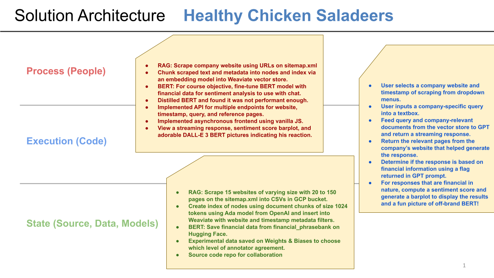

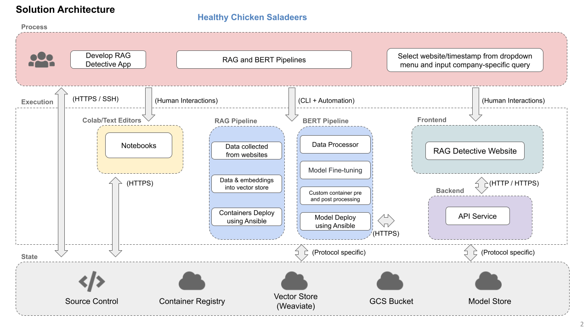

## Technical Architecture:

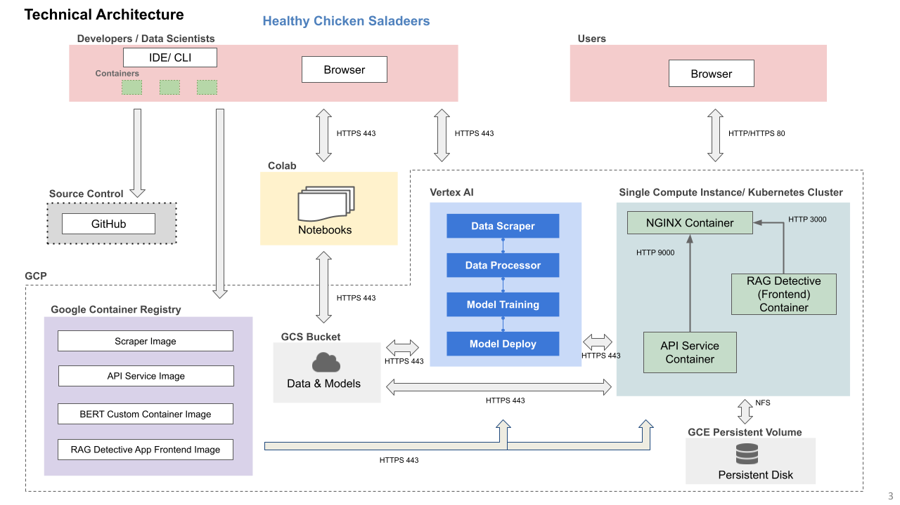

# Tech Stack

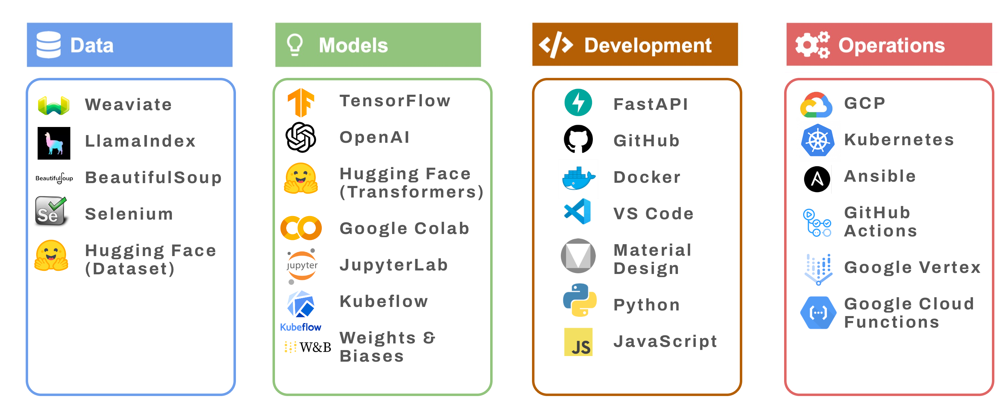


# RAG Component

## FastAPI Web Scraper with Cloud and Vector Store Integration

The Web Scraper API is designed using FastAPI to facilitate the extraction of website sitemap data and integrate with cloud storage and vector databases. It provides endpoints for accessing sitemaps and performing web scraping, with a consideration for handling dynamic content generated by JavaScript. The API includes safeguards for error handling and auxiliary functions to streamline browser interactions, saving data to Google Cloud, and storing data in Weaviate vector stores. It offers solutions for capturing a comprehensive range of data from various types of web pages.

The scraper's output from each webpage is a CSV file that contains the text data extracted from the webpage. It is stored in a GCP bucket as well as inserted into a vector store.

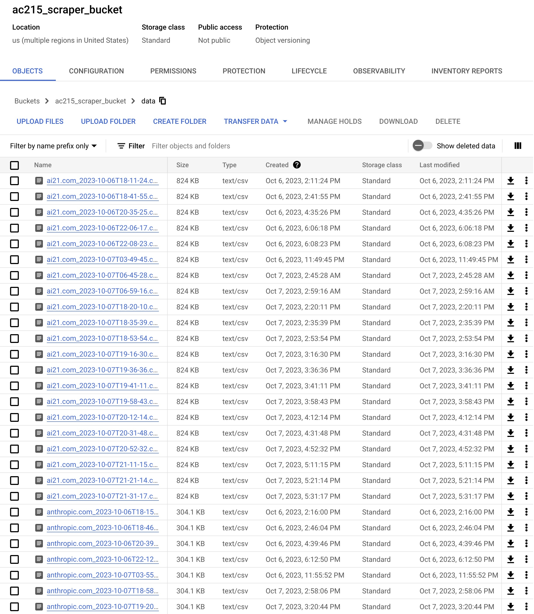

## FastAPI Vector Store Query API

This Query API features capabilities for interfacing with a Weaviate vector store to retrieve and query information. Users can obtain lists of website addresses and timestamps, and perform complex queries using methods based on the Retrieval-Augmented Generation (RAG) technique. The API is constructed to handle asynchronous data processing, providing real-time streaming responses and executing background tasks for data post-processing. It's suitable for applications that require vectorized data retrieval and analysis.

Retrieval Augmented Generation (RAG) serves as a framework to enhance Language and Learning Models (LLM) using tailored data. This approach involves two primary phases:

1. **Indexing Phase**: This is the initial stage where a knowledge base is developed and organized for future references.

2. **Querying Phase**: In this phase, pertinent information is extracted from the prepared knowledge base to aid the LLM in formulating responses to inquiries.

### Indexing Stage

In the initial indexing stage, text data must be first collected as documents and metadata. In this implementation, this is performed by the scraping of website. This data must be then split into "nodes", which is a represents a "chunk" or part of the data containing a certain portion of information. Nodes must are then indexed via an embedding model, where we plan on using OpenAI's `Ada v2` embedding model. The embeddings and metadata together create a rich representation to aid in retrieval.

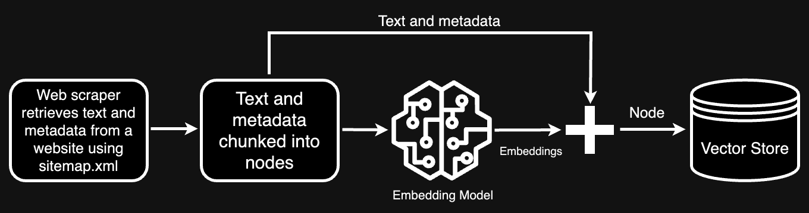

### Querying Stage
In this stage, the RAG pipeline extracts the most pertinent context based on a user’s query and forwards it, along with the query, to the LLM to generate a response. This procedure equips the LLM with current knowledge that wasn’t included in its original training data. This also reduces the likelihood of hallucinations, a problem for LLMs when they invent answers for data they were insufficiently trained with. The pivotal challenges in this phase revolve around the retrieval, coordination, and analysis across one or several knowledge bases.

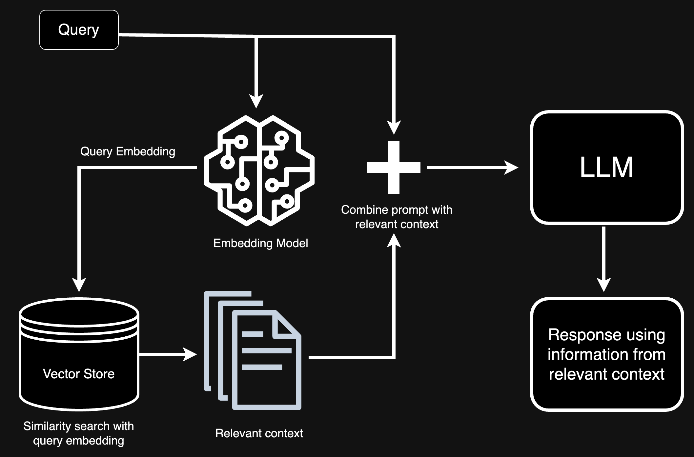

LlamaIndex is a data framework to ingest, structure, and access private or domain-specific data. We use it to chunk our text data and combine it with the metadata to create nodes to insert into the Weaviate vector store.

## Vertex AI Text Classification

This API provides an endpoint for text classification, interfacing with Google's Vertex AI and utilizing a fine-tuned BERT model. It accepts text input for categorization and outputs classification results along with probability scores. The service employs Google Cloud service account authentication and is intended for those needing to classify text for sentiment or thematic content. The results from the Vertex AI model are formatted into a structured JSON response for the client.

# BERT Component

## Fine-tuning BERT with Financial Data for Sentiment Analysis

The use of the `financial_phrasebank` dataset has been important for sentiment analysis in the financial domain, especially given the scarcity of annotated financial data. The dataset encompasses 4846 sentences from English financial news annotated into three sentiment classes—Neutral, Positive, and Negative—based on annotator consensus levels ranging from 50% to unanimity.

A notable trend was observed where the BERT model's performance improved with the degree of consensus among annotators. This highlighted a potential bias; sentences agreed upon by more annotators tend to have clearer sentiment, thus are easier to classify, skewing the model’s perceived accuracy.

### Debiasing Data for Fair Evaluation

In recent developments, we addressed potential biases affecting the BERT classifier's performance, originally fine-tuned on the `financial_phrasebank`. The dataset categorizes financial news sentences into three sentiments with varying consensus levels: 50%, 66%, 75%, and 100% among annotators.

An initial evaluation indicated that models trained on high-consensus data were biased towards easily recognizable sentiments, potentially reducing their real-world efficacy. Recognizing this, the dataset was debiased to balance sentiment distribution across consensus levels. Here is the plot displaying the previous biased results:

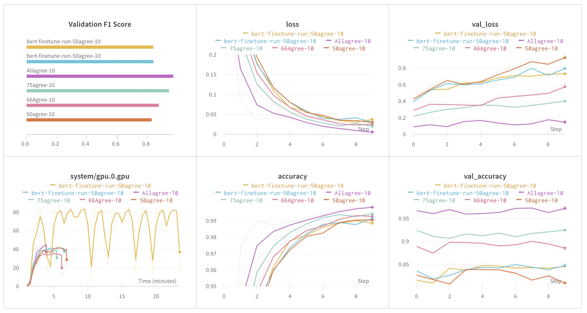

The debiasing involved ensuring random distribution of data points, creating a diversified validation/testing subset from the `sentences_50agree` dataset, and proportionally allocating sentiments for validation and testing to prevent data leakage. The resulting balanced dataset distribution was meticulously confirmed.

Subsequent evaluations with the debiased dataset revealed different performance trends, with models trained on the `66%` annotator consensus initially exhibiting the highest F1 score, while those trained on the `75%` consensus ultimately demonstrated superior performance over 20 epochs.

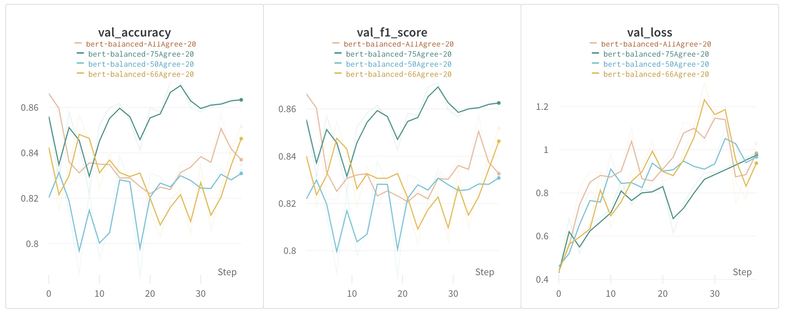

This procedure underscored the significance of accounting for annotator biases in machine learning model development, particularly for sentiment analysis that involves subjective judgments.

# FastAPI Service Summary

This section hosts a Dockerized FastAPI service designed for deployment on Google Cloud. It features a range of files facilitating Docker containerization and FastAPI application management.

## Key Components

### Docker Setup
- `Dockerfile`: Creates a Docker image for the FastAPI app, based on Debian with Python 3.9.
- `docker-shell.sh`: Script to build and run the Docker container, mapping local directories and setting environment variables.
- `docker-entrypoint.sh`: Script that initiates the Uvicorn server to serve the FastAPI app.

### FastAPI Application
- `api/service.py`: The core application file defining API endpoints and their functionalities.
- `api/helper.py`: Provides support functions for the FastAPI routes.

### Documentation and Instructions
- `README.txt`: Basic instructions for Docker image and container operations, and FastAPI interaction.

## API Endpoints Overview
- `GET /`: Returns a welcome message.
- `GET /streaming`: Demonstrates streaming responses using a dummy list of websites.
- `POST /rag_query`: Handles queries with streaming response.
- `GET /websites`: Lists website addresses.
- `GET /timestamps/{website_address}`: Retrieves timestamps for a specific website.
- `GET /get_urls/{query_id}`: Fetches URLs and financial flags for a query.
- `POST /vertexai_predict`: Uses Vertex AI's Prediction API for sentiment analysis.
- `GET /sitemap`: Processes input in various forms, such as straightforward website names, fully qualified URLs, direct sitemap links, or URLs ending with a slash, to ensure effective sitemap scraping. The response encapsulates the status, number of pages found, nested sitemap flags, and pertinent messages.
- `POST /scrape_sitemap`: Initiates the scraping of sitemaps and sequentially performs procedures such as streaming, saving to Google Cloud storage, and insertion into a vector storage system. During this operation, real-time updates are streamed to the client, informing them of the progress and completion of each step.

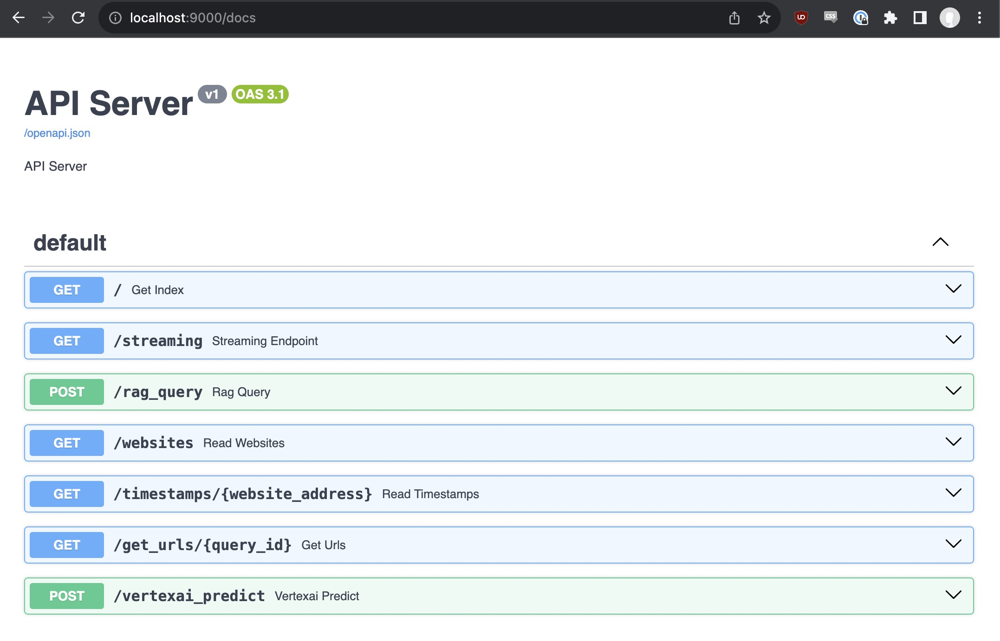

The repository offers comprehensive guidance on setting up and running the Dockerized FastAPI service, alongside detailed documentation accessible through the FastAPI's interactive documentation feature.

For more information and detailed instructions, see [api-service-documentation.md.](./docs/api-service-documentation.md)

# Frontend Service Summary

This section contains a Dockerized frontend application, suitable for deployment with a web server. It includes essential files for building and running the application in a Docker container.

## Key Components

### Docker Setup
- `Dockerfile`: Creates a Docker image using nginx, copies HTML and CSS files into the container, and exposes port 80.
- `docker-shell.sh`: A script for building the Docker image and running a container, mapping the container's port 8080 to the host's port 8080.
- `README.txt`: Documentation on building and running the Docker container for both simple and React frontends.

### Frontend Application: Using RAG with website data
- `index.html`: The main HTML file for the app, setting up the layout and interactive elements for the "Rag Detective" web application.
- `styles.css`: Defines the visual design of the application, including animations, color schemes, and responsive elements for a user-friendly interface.

We generated 30 different non-copyright-infringing off-brand Bert images using OpenAI’s DALL-E 3, 10 each for positive, negative, and neutral sentiment. Depending on which sentiment is found, the front end chooses one of the appropriate sentiment images at random to display along with the classes.


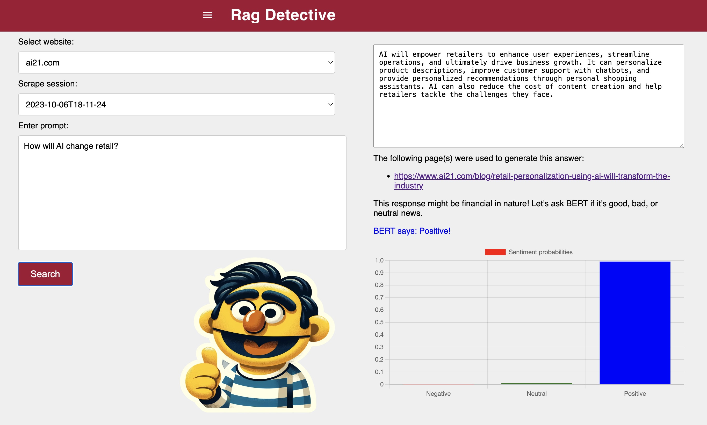
---
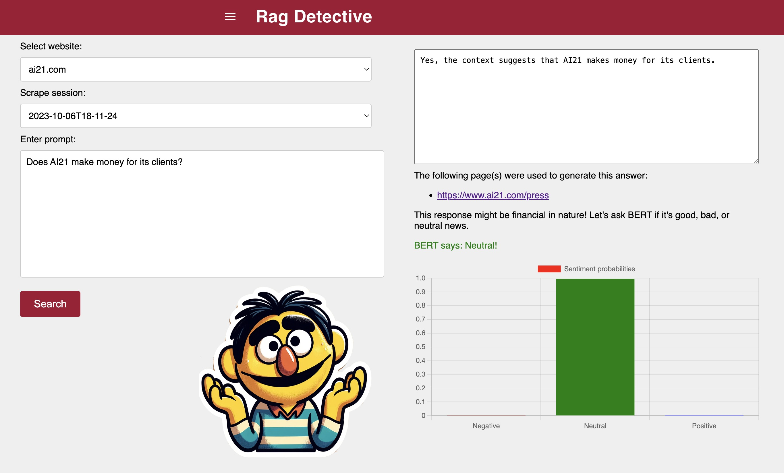

### Frontend Application: Real-time scraping of website data

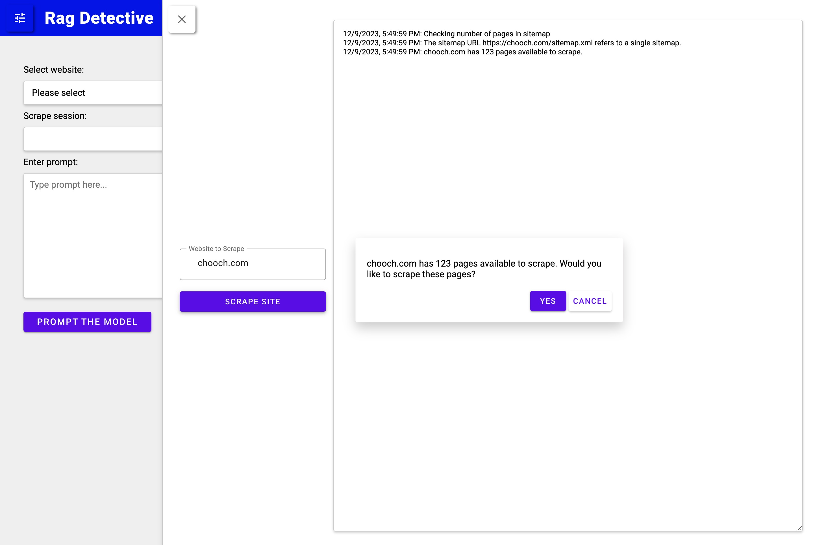
---
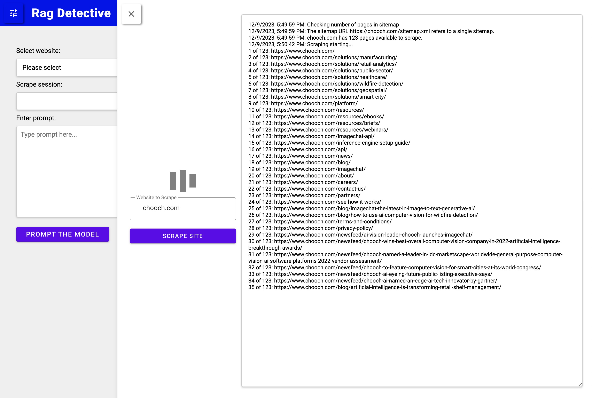

## Detailed Overview

### Dockerfile and Scripts
- **Dockerfile**: Outlines steps for building the Docker image with a lightweight web server and deploying the frontend application.
- **docker-shell.sh**: Automates the Docker image building and container running processes.
- **README.txt**: Provides detailed instructions for Docker operations and frontend deployment.

### index.html
- Features interactive elements for selecting websites and timestamps, inputting queries, and displaying responses.
- Implements API interactions for fetching website data, submitting queries, and retrieving URLs and sentiment analysis.
- Displays dynamic content based on user interactions and server responses, including sentiment-driven images of a chatbot character, BERT.

### styles.css
- Applies modern styling to the web application, utilizing Google's Roboto font and various CSS animations.
- Ensures a cohesive and appealing visual experience, with designated styles for different UI components.

For a comprehensive guide on setting up and interacting with the frontend application, see [frontend.md.](./docs/frontend.md)

# Financial Sentiment BERT Custom Model Container

This section provides the setup for deploying a BERT model, fine-tuned for financial sentiment, using FastAPI, Docker, and Google Vertex AI.

## Key Components

### Files and Scripts
- `predictor.py`: Handles pre-processing, model prediction, and post-processing.
- `app.py`: A FastAPI wrapper for serving the model.
- `Dockerfile`: Defines Docker commands for setting up the API's image.
- `shell_script.sh`: Builds and runs the Docker image.

### Detailed Descriptions

#### Predictor.py
- `CustomPredictor` class: Manages predictions, loading the model, and providing API readiness status.
- `CustomModelPredictor` class: Handles model loading, prediction, and pre/post-processing tasks.

#### App.py
- Implements FastAPI endpoints for health checks (`/health`) and predictions (`/predict`).

#### Dockerfile
- Configures the TensorFlow image base, copies code, installs dependencies, and starts the API on port 8080.

#### Shell Script
- Automates Docker image building and container launching, binding the container's port 8000 to the host's port 8000.

## Usage Instructions
- Download the pre-trained model from Google Cloud Storage.
- Build and run the Docker container using `docker-shell.sh`.
- Test the API using `curl` commands.

# Deployment to Google Cloud Vertex AI

### Step-by-Step Guide
1. **Build and Push Docker Image:** Set environment variables, build the Docker image, and push it to the Google Container Registry.
2. **Upload Model to Vertex AI:** Use `gcloud` commands to upload the model to Vertex AI, specifying custom health and prediction routes.
3. **Create Endpoint:** Generate an endpoint for model serving.
4. **Deploy Model to Endpoint:** Deploy the model using `gcloud` commands and test via the cloud console or `curl`.

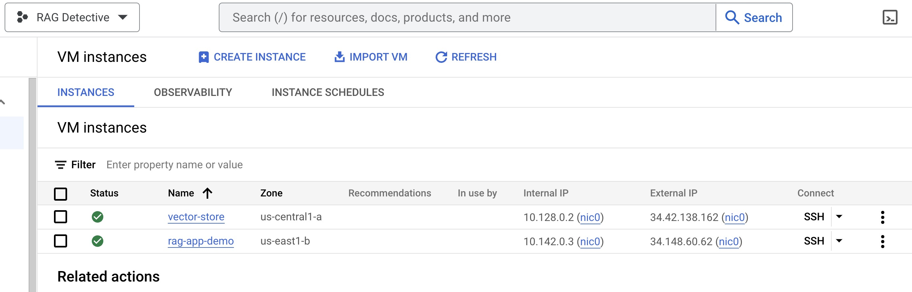

## Cloud Testing
- Test the deployed model and endpoint on Google Cloud's console or using `curl` commands.

This repository offers comprehensive guidance on setting up, testing, and deploying the BERT model for financial sentiment analysis using Docker and Google Vertex AI.

For more information and detailed instructions, see [deploy-custom-container-BERT-vertex.md.](./docs/deploy-custom-container-BERT-vertex.md)

# Deployment with Ansible

### Setup GCP for Deployment
- **Enable GCP APIs**: Compute Engine, Service Usage, Cloud Resource Manager, Google Container Registry APIs, and Kubernetes Engine API
- **GCP Service Accounts**: Steps to create and configure service accounts like `deployment` and `gcp-service` with specific roles for deployment activities.

### Docker Container Setup
- Using Docker to build a container for connecting to GCP and creating VMs.
- Detailed instructions for building and running the Docker container, including the expected output.

### SSH Configuration
- Enabling OS login and creating SSH keys for the service account.
- Adding public SSH keys to instances for secure access.

### Deployment with Ansible
- **Build and Push Docker Containers to GCR**: Utilizing Ansible to automate the process.
- **Create Compute Instance (VM) Server in GCP**: Steps to create a VM and update the inventory file with its external IP address.
- **Provision Compute Instance in GCP**: Instructions for installing and setting up required deployment elements.
- **Setup Docker Containers in the Compute Instance**: Configuring and launching necessary Docker containers.

### Web Server Configuration
- Creating and setting up an Nginx configuration file for the web server.
- Deploying and restarting the Nginx container to reflect changes.

# Scaling with Kubernetes
Creating and deploying a Kubernetes cluster within GKE involves a few steps:

- **Define the Cluster:** Using a YAML configuration file, define the specifications of the GKE cluster.
- **Create the Cluster:** Use Ansible playbooks to create and initialize the cluster on GKE.
- **Deploying the Application:** Kubernetes deployment manifests are used to deploy and manage the application on the cluster. The manifests define the properties of the container like the Docker image to use, the number of replicas, networking rules, etc.
- **Service & Ingress Configuration:** Specify the networking rules and load balancing for the application using Kubernetes Service and Ingress objects.
- **Autoscaling:** Allow the application to meet traffic needs by automatically adjusting the number of running instances of the application. This is achieved through Kubernetes Deployment objects and Horizontal Pod Autoscaler configurations.
- **Monitoring & Management:** Monitor the performance of workloads, set up alerts, and debug issues that arise.

Deploying and scaling the RAG Detective App on a Kubernetes cluster managed by GKE allows for for load balancing, failover, and scalability. Ansible scripts help to keep track of our infrastructure and set up automated deployments.

If our app were to go viral, Kubernetes would help our app scale with the increase in traffic. For example, if 10,000 people were using the site on a given day, the Kubernetes cluster on Google Kubernetes Engine (GKE) is designed to dynamically adjust and scale to meet the demand. Here's how the scaling process would likely occur: 

#### Node Scaling:
   - If the cluster is configured with Auto Scaling enabled, GKE will automatically add more nodes to the cluster to handle the increased load. These nodes are added based on resource utilization metrics, ensuring that there's enough computational capacity to run the application.

#### Pod Scaling:
   - Kubernetes Horizontal Pod Autoscaler (HPA) will come into play. HPA monitors the resource utilization of the pods (e.g., CPU or memory) and adjusts the number of pod replicas to maintain a specified target utilization. If the current utilization is high, HPA will scale up the number of pod replicas to distribute the load.

#### Load Balancing:
   - Kubernetes Services, combined with GKE's integration with Google Cloud Load Balancer, distribute incoming traffic among the available pod replicas. This ensures that no single pod or node becomes a bottleneck and that the load is evenly distributed across the cluster.

#### Resource Allocation:
   - With an increase in demand, Kubernetes will intelligently allocate resources to the newly created pods. This is crucial for maintaining performance and responsiveness as user traffic fluctuates.

#### Monitoring and Alerts:
   - GKE's integration with monitoring services like Stackdriver allows easy setup of alerts based on predefined metrics or custom queries. If there are any performance issues or if resource utilization is reaching critical levels, a notification can be sent to take proactive measures.

#### Cost Optimization:
   - Node Pools in GKE allow cost optimization. Depending on traffic patterns, we can dynamically adjust the size and type of nodes in different node pools to match the resource requirements of our application, ensuring cost-effectiveness.

#### Logging and Debugging:
   - In case of any issues, we can leverage the logging capabilities provided by GKE to troubleshoot and debug. The centralized logging helps understand the behavior of the application and identify any bottlenecks or errors.

#### Scaling Down:
   - As traffic subsides, the HPA will monitor the reduced resource utilization. If the demand decreases, Kubernetes will scale down the number of pod replicas and, if needed, shrink the number of nodes in the cluster to optimize resource usage and reduce costs.

By employing these Kubernetes and GKE features, our application can automatically handle variations in traffic, providing a scalable, reliable, and cost-efficient infrastructure that automatically adapts to the changing demands of our users.

One thing to note is that our Weaviate instance will not scale with our other containers, and implementing database scaling is beyond the scope of the course and a science in its own right. For scaling Weaviate, horizontal scaling is the primary approach, involving the addition of more nodes to the cluster to distribute the workload evenly. Alongside this is load balancing, which helps in evenly distributing incoming requests across the available nodes. Data sharding can be done as well, where data is partitioned across multiple nodes, allowing for efficient processing of queries. Kubernetes can also be used to automate the scaling and management of Weaviate instances, ensuring that the system remains robust and efficient as it grows to meet rising demands. 

Here is our deployed application on a Kubernetes cluster in GCP:


To run the deployment container with Kubernetes locally:

```
cd src/deployment
run sh docker-shell.sh
```
#### Build and Push Docker Containers to GCR 
```
ansible-playbook deploy-docker-images.yml -i inventory.yml
```
#### Create and Deploy K8s Cluster
```
ansible-playbook deploy-k8s-cluster.yml -i inventory.yml --extra-vars cluster_state=present
```

Note: the Nginx IP address will print out to the screen after running the above command. You will use this to view the app in your browser.

#### View the App
Go to `http://<NGINX INGRESS IP>.sslip.io`

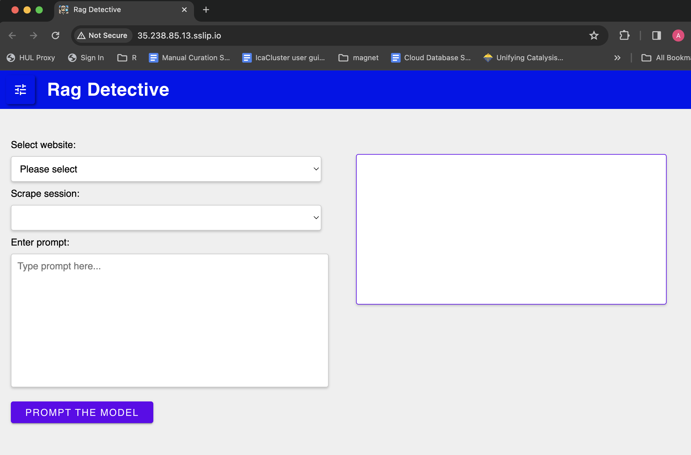

# Deployment Testing and Verification
- Commands to SSH into the server or k8s cluster, check container statuses, and access logs.
- Verification of the web server's functionality by accessing the deployed app via its external IP address.

Deploying the RAG Detective App using Ansible and scaling with Kubernetes ensuring a streamlined and secure deployment process.

For more information and detailed instructions, see [deployment.md.](./docs/deployment.md)

# Deploy using GitHub Actions
Additionally, we added CI/CD using GitHub Actions to trigger deployment. Our yaml file can be found under `.github/workflows/ci-cd.yml` in the project repo.

The yaml file implements a CI/CD workflow that

* Invokes docker image building and pushing to GCR on changes to code in the respective containers and when committed to git with the comment "/run-deploy-app".
* Deploy the updated containers to the k8s cluster in GKE.

You can view the progress of the deployment in GitHub under the Actions tab:

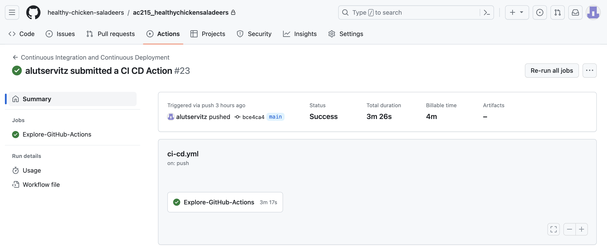

For more information and detailed instructions, see [github-actions.md.](./docs/github-actions.md)
