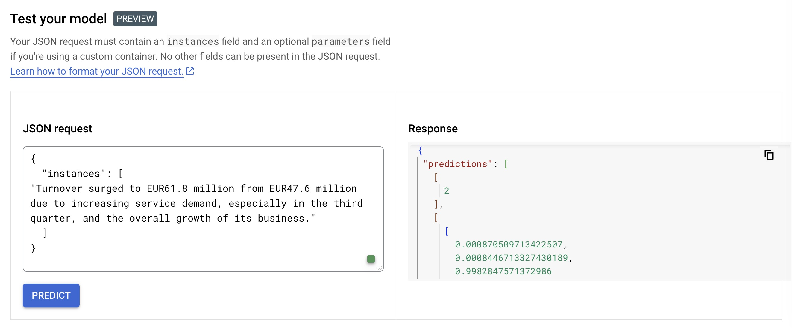

# Creating the custom container for the Financial Sentiment BERT model

This repository contains codes for a BERT model fine-tuned on financial sentiment and deployed onto Google Vertex using FastAPI and Docker.

## Files

The repository contains the following files in the `ml_workflow/inference` folder:

1. `predictor.py`: Contains the classes and functions used for pre-processing, model prediction and post-processing of data.

2. `app.py`: Implements a FastAPI API wrapper which serves the model.

3. `Dockerfile`: Specifies the Docker commands that automate the setup of the image that will be used to run our API.

4. `shell_script.sh`: Shell script to build and run the Docker image.

## Predictor.py Description

#### `CustomPredictor` class:

This class is responsible for handling predictions. It takes a model as an argument during initialization.

- `is_ready()` function: Used by the API to let Google Vertex know when the model and tokenizer have been loaded.

- `predict(instances, **kwargs)` function: Given a list of input `instances`, it preprocesses the input, runs model prediction and then postprocesses the prediction results.

- `from_path(cls, model_dir)` class method: This loads the model, specifically the BERT model, from a given `model_dir`.

#### `CustomModelPredictor` class:

This class is responsible for the nuts and bolts of loading and predicting with the model.

- `__init__(self, model_path)` function: Loads the pretrained keras model from the given `model_path` and the BERT tokenizer from transformers.

- `predict(instances)` function: Makes predictions given a list of `instances`.

- `preprocess(instances)` function: Tokenizes and processes the inputs as required by the BERT model.

- `postprocess(predictions)` function: Applies softmax to the output logits to obtain class probabilities and finds the class with maximum probability.

## App.py Description

This file serves the model as an API using FastAPI.

- `Item` class: Pydantic model to ensure the request body is an array.

- `/health` endpoint: Returns whether the model is ready or not.

- `/predict` endpoint: Takes in input from the user, passes it to the model, and returns the prediction.

## Dockerfile Description

The Dockerfile consists of setup instructions for the image of our API. Here it pulls from the tensorflow image as a base, adds the codes into `/app` directory, installs required dependencies and starts the API on port 8080 within the container.

## Shell Script Description

The shell script launches the Docker container. This involves building the image, defining environment variables such as the image name, base directory and model directory path, and then running the image. The app in the container binds to port 8000 of the host.

## Usage instructions

First you need to download the model which was previously trained on Google Vertex and stored in the `rag-detective-ml-workflow` bucket. The following command can be run if you follow the instructions to install the `gcloud` CLI documented in [gcp-cli-instructions-macos.md](gcp-cli-instructions-macos.md).

```
gsutil -m cp -r \
  "gs://rag-detective-ml-workflow/best_model" \
  .
```

With the model in the `/best_model` folder, the container can be launched with the `docker-shell.sh` command. The API can then be tested as follows:
```
curl -X POST "http://localhost:8000/predict" -H "accept: application/json" -H "Content-Type: application/json" -d "{\"instances\":[\"Turnover surged to EUR61 .8 m from EUR47 .6 m due to increasing service demand , especially in the third quarter , and the overall growth of its business .\"]}"
```

which returns the `json`

```
{"predictions":{"class":[2],"probabilities":[[0.00026696702116169035,4.530536534730345e-05,0.9996877908706665]]},"success":true}%   
```

# Deployment onto Google Cloud Vertex AI

Below are the instructions to guide you through the process of deploying the custom Docker image to Google Vertex AI. 

## Step 1: Build and Push Docker Image

First, set the project ID, the name of the Docker image repository, and the Image URI using the following commands:

```shell
export PROJECT_ID="rag-detective"
export IMAGE_REPO_NAME="financial_sentiment_docker_image"
export IMAGE_URI=gcr.io/$PROJECT_ID/$IMAGE_REPO_NAME
```

Then use Docker to build the image and tag it with the Image URI:

```shell
docker build -f Dockerfile -t $IMAGE_URI .
```

Finally, push the Docker image to the Google Container Registry (GCR):

```shell
docker push $IMAGE_URI
```

The `-f` flag specifies the Dockerfile to use for building the image, and the `-t` flag tags the resulting image with the Image URI. Pushing the image uploads it to the GCR where it is stored in the Google Cloud project and is accessible by the Project ID.

## Step 2: Upload Model to Vertex AI

To upload the model to Vertex AI, execute the following command:

```shell
gcloud beta ai models upload \
  --region=us-central1 \
  --display-name="financial_sentiment" \
  --container-image-uri=$IMAGE_URI \
  --container-health-route=/health \
  --container-predict-route=/predict
```

The `--container-image-uri` flag references the location of the pushed Docker image. The `--container-health-route` and `--container-predict-route` flags are the health check and prediction endpoints of the FastAPI app, respectively. 

These custom endpoints replace the default Vertex AI health and prediction endpoints, which are `/v1/endpoints/${AIP_ENDPOINT_ID}/deployedModels/${AIP_DEPLOYED_MODEL_ID}` and `/v1/endpoints/${AIP_ENDPOINT_ID}/deployedModels/${AIP_DEPLOYED_MODEL_ID}:predict` respectively. 

For the default health endpoint, Vertex AI sends health check calls to it. If Vertex AI receives 404 responses from the health endpoint, it will eventually error out after multiple unsuccessful health checks.

For the default predict endpoint, Vertex AI forwards prediction requests. If you don't specify the correct predict endpoint while deploying the model(`/predict`, in this case), the prediction API call to Vertex AI would return an empty JSON response.

When deploying, using `--container-health-route=/health` and `--container-predict-route=/predict` ensures that the correct routes in the FastAPI app are aligned with the calls Vertex AI makes for health checks and prediction requests. This helps avoid the issues associated with Vertex AI's default routes.

To list all models and retrieve the model ID, use the following command:

```shell
gcloud ai models list --region=us-central1
```
Take note of the returned model ID for the next step.

## Step 3: Create Endpoint

To create an endpoint for serving the model, run:

```shell
gcloud beta ai endpoints create \
  --region=us-central1 \
  --display-name=financial_sentiment_endpoint
```
To list all available endpoints, use:

```shell
gcloud ai endpoints list --region=us-central1
```
Record the created endpoint id for the next step.

## Step 4: Deploy Model to the Endpoint

Deploy the model to the endpoint with the following command:

```shell
gcloud beta ai endpoints deploy-model {ENDPOINT_ID} \
  --region=us-central1 \
  --model={MODEL_ID} \
  --display-name=financial_sentiment_deployment \
  --machine-type=n1-standard-4 \
  --min-replica-count=1 \
  --max-replica-count=1 \
  --enable-container-logging
```
Replace `{ENDPOINT_ID}` and `{MODEL_ID}` with the respective IDs you obtained from the previous steps.

This command deploys the model to the specified endpoint. This process may take some time. If the operation times out, you can monitor it using:

```shell
gcloud beta ai endpoints describe {ENDPOINT_ID} --region=us-central1
```

You can then test the model and endpoint on the cloud console:



Or using cURL:

```
ENDPOINT_ID="7054451210648027136"
PROJECT_ID="94374012410"
INPUT_DATA_FILE="INPUT-JSON"

curl \
-X POST \
-H "Authorization: Bearer $(gcloud auth print-access-token)" \
-H "Content-Type: application/json" \
https://us-central1-aiplatform.googleapis.com/v1/projects/${PROJECT_ID}/locations/us-central1/endpoints/${ENDPOINT_ID}:predict \
-d '{
  "instances": [
    "Turnover surged to EUR61 .8 m from EUR47 .6 m due to increasing service demand , especially in the third quarter , and the overall growth of its business ."
  ]
}'
```

which returns

```
{
  "predictions": [
    [
      2
    ],
    [
      [
        0.000870509713422507,
        0.00084467133274301887,
        0.99828475713729858
      ]
    ]
  ],
  "deployedModelId": "5350564429362626560",
  "model": "projects/94374012410/locations/us-central1/models/4067328806631768064",
  "modelDisplayName": "financial_sentiment",
  "modelVersionId": "1"
}
```

In order to incorporate this Vertex API call into our own API, see that document.git
