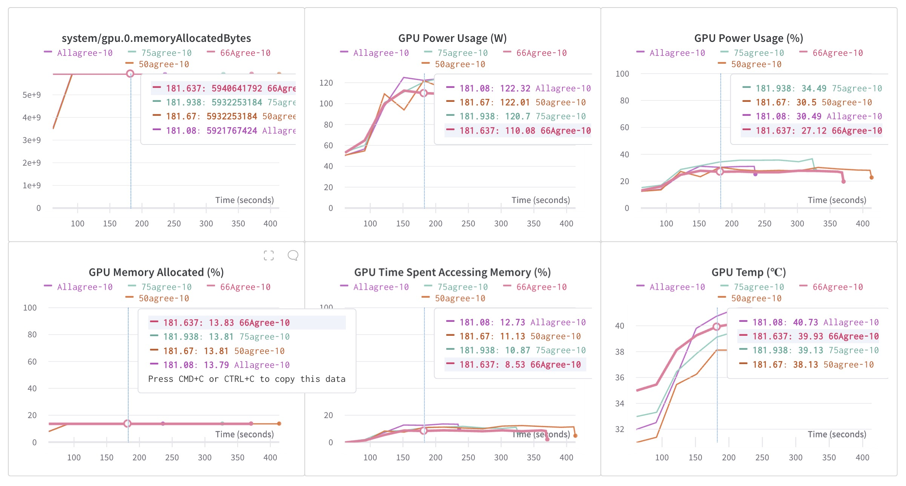
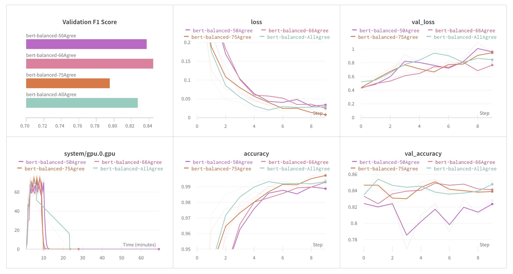

# BERT Fine-tuning on Financial Data

_An analysis of the BERT classifier's performance on the financial_phrasebank dataset, showcasing the influence of annotator consensus on sentiment prediction and its implications for financial sentiment analysis._

Sentiment analysis in financial news plays a significant role in predicting stock market trends. The availability of high-quality annotated training data is a challenge, especially in the financial domain. In this brief report, we've fine-tuned a BERT classifier on financial sentiment using the [financial_phrasebank](https://huggingface.co/datasets/financial_phrasebank) dataset and highlighted the potential biases in performance due to the varying consensus levels in sentiment labeling.

### Dataset Overview

The financial_phrasebank dataset consists of 4846 sentences extracted from English-language financial news. These sentences are categorized into three sentiment classes:
- Neutral: 2879 entries (59.4%)
- Positive: 1363 entries (28.1%)
- Negative: 604 entries (12.4%)

**Fields in the Dataset:**
- **Sentence**: Tokenized lines from the dataset.
- **Label**: A sentiment label as a string: 'positive', 'negative', or 'neutral'.

**Dataset Configurations:**
The dataset provides four configurations based on the percentage of agreement among annotators:
- **sentences_50agree**: >=50% annotator agreement: 4,846 sentences
- **sentences_66agree**: >=66% annotator agreement: 4,217 sentences
- **sentences_75agree**: >=75% annotator agreement: 3,453 sentences
- **sentences_allagree**: 100% annotator agreement: 2,264 sentences

### Curation Rationale

A significant challenge in the domain of financial sentiment analysis is the scarcity of annotated datasets, especially those that are publicly available. The `financial_phrasebank` dataset was curated to address this gap and provide a benchmark for various modeling techniques.

The primary goal during annotation was to categorize each sentence into positive, negative, or neutral sentiments from an investor's perspective. Specifically, the sentiment that would potentially influence stock prices was considered. Sentences irrelevant from an economic or financial standpoint were labeled as neutral.

### Source Data

The dataset was derived from English news on all companies listed in OMX Helsinki. A random subset of 10,000 articles was selected to ensure diversity across companies, industries, and news sources. Sentences not containing any lexicon entities were excluded, and a final random sample of approximately 5000 sentences was chosen for annotation. 

**Language Producers:**
The primary source data comprises financial news articles written by various financial journalists.

### Annotations

A total of 16 individuals with a background in financial markets annotated the dataset. Given the substantial overlap in annotations (5 to 8 annotations per sentence), four alternative reference datasets were formulated based on the strength of majority agreement.

**Annotators:**
Among the annotators, three were researchers, while the remaining 13 were master's students from Aalto University School of Business with specializations in finance, accounting, and economics.

## Training Description

### Hyperparameters and Tools:

- **BERT Model:** A pre-trained 'bert-base-uncased' version was used, which is the base version of `BERT` with all lowercase letters.
- **Tokenizer:** The same 'bert-base-uncased' tokenizer is used to tokenize the data.
- **Learning Rate:** Started with `3e-5`, which decays exponentially with a decay rate of `0.9` every `10000` steps.
- **Optimizer:** Adam optimizer.
- **Loss Function:** Sparse Categorical Crossentropy with Logits
- **Metrics:** Accuracy for monitoring the training process.
- **Batch Size:** 8.
- **Epochs:** 10. We experimented with early stopping, but 10 seemed to give better results.

### Dataset and pre-processing:

- The dataset is in a format with sentences and their labels separated by the '@' delimiter.
- The dataset was split into training (70%), validation (15%), and test (15%) sets.
- Sentences were tokenized using BERT's tokenizer. Paddings were added to make all sequences of equal length.
- Labels were mapped to integers: negative -> 0, neutral -> 1, positive -> 2.
- Encodings and labels were converted into TensorFlow datasets for efficient training.

### Modeling:

- For the model, a pre-trained BERT model with a classification layer on top was used. This allows you to leverage the pre-trained weights of BERT while fine-tuning for a specific task.
- Early stopping was initialized but not used (commented out). It would stop the training if the validation loss doesn't improve for 2 epochs and restore the weights from the best epoch.
- A custom callback `F1_Evaluation` was created to compute the F1 score after every epoch on the validation data.
- The model was trained using the training dataset and validated with the validation dataset.

## Evaluation:

- After training, the model was evaluated on the test set.
- The performance was measured using the F1 score.

### Experiment Tracking:

- Weights & Biases (W&B) was used for experiment tracking. With the `WandbCallback`, all the metrics, loss, etc., get logged into the W&B dashboard for visualization and analysis.

### Reflection on Plots:

- **Validation F1 Score:** From the first plot, it looks like the model trained with the `Allagree-10` dataset has the highest F1 score, followed closely by the `75agree-10` dataset. This indicates that a higher annotator agreement generally leads to better model performance.
- **Loss & Val_loss:** Both training and validation loss curves show a consistent decreasing trend, suggesting that the model was learning throughout the 10 epochs. Among the configurations, `bert-finetune-run-50agree-10` and `Allagree-10` seem to perform similarly well, with the latter having a slightly better validation loss.
- **Accuracy & Val_accuracy:** Training accuracy for all configurations converges near 99%. However, the validation accuracy, which is more indicative of how well the model will perform on unseen data, suggests `bert-finetune-run-50agree-10` and `Allagree-10` have superior performance.
- **System/GPU Utilization:** The GPU usage shows cyclical peaks. This is expected because the GPU will be intensively used during forward and backward passes, and then there will be less activity during parameter updates.

### Conclusion:

The model seems to perform best when trained on data with a higher degree of annotator agreement. This makes intuitive sense, as such data would likely be more consistent and clear, leading to a more effective training process. The GPU utilization plot suggests efficient batching during training. All configurations appear to have learned well over the epochs, but for the best performance, considering both validation loss and F1 score, the `Allagree-10` configuration might be the preferred choice.

### Discussion on Training Results:

The training results indicate a trend: as the consensus among annotators increases, the model's performance improves. This observation could be attributed to clearer and more distinct sentiments present in sentences with higher annotator agreement. However, a potential bias emerges with this observation. Sentences with higher consensus might inherently be more clear-cut in their sentiments, making them easier to predict. 

To put this simply:
- Perhaps the model trained on the `AllAgree` dataset performed best because not only was it trained on financial data with more obvious sentiment, but it was also tested on financial data with obvious sentiment.
- Equivalently, maybe the model trained on `50Agree` performed poorly because it was trained with more nuanced sentiment, and also tested more nuanced sentiment.

To mitigate potential biases and validate the model's robustness, we should evaluate it on a test set derived from the entire dataset, without considering the annotator agreement levels. This is a bit more tricky to create than just a random split of the data; ideally a good test set should sample from all four of the consensus datasets equally, a problem compounded by their imbalance in sizes (4846, 4217, 3453, and 2264 sentences).

### Initial Conclusion:

While the financial_phrasebank dataset offers a valuable resource for financial sentiment analysis, care must be taken when interpreting results based on annotator agreement levels. Future work should focus on unbiased evaluation and further exploration of potential factors influencing model performance in this domain.

Looking at the below results at face value, it would indeed appear that the higher the level of annotator consensus on a dataset, the more performant the model trained on it performs.

### Initial Training Results

### Retraining with Unbiased Data

As discussed in the initial conclusion, the varying levels of annotator agreements create an unusual challenge. The aim is to create a train, test, and validation split that does not bias the model towards obvious sentiments. Here we describe each step in the data-splitting process to de-bias the data as described, and the results of retraining.

### Step 1: Load the Data

Firstly we load the dataset files (which are text files in this case). Considering the possibility that these text files might have different encodings (they initially crashed the program as they use `ISO-8859-1`), we use Python's `chardet` library to detect the encoding before reading the file. This ensures that the loading of files doesn't fail due to encoding issues. The data is then shuffled randomly. The shuffling was an easy thing to miss, as previously we had used `train_test_split` from `scikit-learn` to split the data, and it had automatically shuffled the data. The data actually comes nearly sorted by sentiment, so without shuffling, the model can't be fine-tuned at all.

The files are read in the following way:
- Every sentence in the dataset is separated by an '@' delimiter.
- There are no headers in the files so they are assigned later as ['sentence', 'label'].
- We use pandas' `read_csv` function to read these files.

### Step 2: Create a Subset from 'sentences_50agree'

The `sentences_50agree` dataset is the largest and most diverse dataset. To avoid overfitting and create a diverse validation set, we create a subset from this dataframe that will later be used for validation/testing. This subset is the same size as the train set.

### Step 3: Split the Subset into Validation and Test Sets

The subset created from `sentences_50agree` is split into validation and test sets. Here, a stratified sampling is performed to ensure that the split datasets have instances of each class ('positive', 'negative', and 'neutral') in proportions close to their original distribution in the parent dataset. The dataset is split in such way that 31% data is used for validation/testing. We choose 31% as this seems to result in the closest to a 70/15/15 train/validate/test split once the datasets have been assembled.

### Step 4: Update the Training Set

After obtaining the validation and test sets, we remove sentences present in these sets from the training set. This is done to avoid data leakage and ensure that the model doesn't see any sentence in the training phase that it would later encounter in the validation/testing phase.

### Step 5: Further Divide the Validation and Test Sets

The validation/test set subset is then divided equally into two parts: one part forms the validation set and the other part forms the test set.

### Step 6: Output the Sizes and Percentages

Finally, after creating all the datasets, we output the sizes of the train, validation, and test datasets along with their respective percentages to make sure that the classes are as balanced as they can be given the data.

This completed our data splitting process to ensure that we had a good mix of data in each dataset and our model does not get biased towards the easy-to-identify financial sentiments.

### De-biased Conclusion

It now appears that the 66% annotator consensus has the highest F1 score. This is a preliminary finding, but it shows clearly that the previous trend of the model's performance increasing with annotator consensus was misleading. Perhaps at 66% annotator consensus, we have a decent compromise to train the model.

### De-biased Experimental Results

