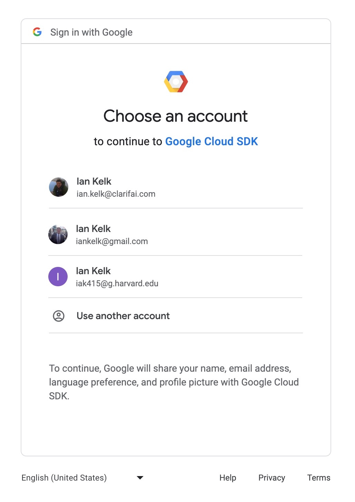
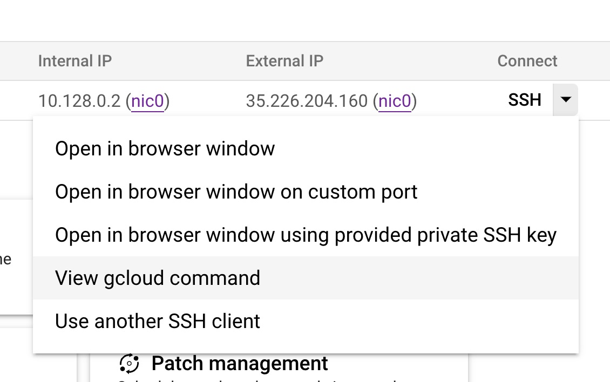

# Installing and Using Homebrew and `gcloud` CLI on macOS

### 1. Installing Homebrew (If Homebrew not already installed)

If you don't have Homebrew installed on your macOS, follow these steps:

1. Open your terminal.
2. Run the following command to download and install Homebrew:
   
```bash
/bin/bash -c "$(curl -fsSL https://raw.githubusercontent.com/Homebrew/install/HEAD/install.sh)"
```

3. Once the installation is complete, you can confirm it's installed by checking its version:

```bash
brew --version
```
---

### 2. Updating Homebrew and Installed Software (If Homebrew already installed)

If you already have Homebrew installed and want to update everything, follow these steps:

1. Update Homebrew itself and the formulae definitions:

```bash
brew update
```

2. Upgrade all outdated formulae and casks at once:

```bash
brew upgrade
```

3. Clean up old versions of installed formulae and casks to free up disk space:

```bash
brew cleanup
```

---

### 3. Installing `gcloud` CLI

To install the `gcloud` CLI using Homebrew:

1. Run the following command:

```bash
brew install --cask google-cloud-sdk
```

2. After installation, initialize the `gcloud` CLI:

```bash
gcloud init
```

This will guide you through the process of authorizing the CLI and setting the default configuration.

---

### 4. Running `gcloud init`

You will receive the following prompt in the MacOS terminal:

```text
Welcome! This command will take you through the configuration of gcloud.

Your current configuration has been set to: [default]

You can skip diagnostics next time by using the following flag:
  gcloud init --skip-diagnostics

Network diagnostic detects and fixes local network connection issues.
Checking network connection...done.                                                                                                                                  
Reachability Check passed.
Network diagnostic passed (1/1 checks passed).

You must log in to continue. Would you like to log in (Y/n)?
```

Choosing yes will display this:

```text
Your browser has been opened to visit:

    https://accounts.google.com/o/oauth2/auth?response_type=QUERY_STRING_SNIPPED

```

Your browser will open with a standard Google login screen. Choose the email associated with this project; for me it was my `g.harvard.edu` address.



Once logged in, you'll see this prompt:

```text
You are logged in as: [iak415@g.harvard.edu].

This account has a lot of projects! Listing them all can take a while.
 [1] Enter a project ID
 [2] Create a new project
 [3] List projects
```

It will print out the first 50 projects in the organization -- ie. Harvard AC215 -- so as you might guess there are hundreds in total. It will then state:

```text
Did not print [490] options.
Too many options [540]. Enter "list" at prompt to print choices fully.
Please enter numeric choice or text value (must exactly match list item):
```

Entering `list` will have it print out the names of 540 projects. Our project is `rag-detective` and is number `414`, so enter `414` at the following prompt:

```text
Please enter numeric choice or text value (must exactly match list item):  414

Your current project has been set to: [rag-detective].
```

It will then ask if you would like to set a default region. This is just where the instance will be loaded when you start it up.

```text

Do you want to configure a default Compute Region and Zone? (Y/n)?
```

We have already set this to `us-central1-a` on the website, so I didn't choose. You can check [Google's reference](https://cloud.google.com/compute/docs/regions-zones) which lists all regions and zones.

```text
Created a default .boto configuration file at [/Users/iankelk/.boto]. See this file and
[https://cloud.google.com/storage/docs/gsutil/commands/config] for more
information about configuring Google Cloud Storage.
Your Google Cloud SDK is configured and ready to use!

* Commands that require authentication will use iak415@g.harvard.edu by default
* Commands will reference project `rag-detective` by default
* Compute Engine commands will use zone `us-east1-d` by default

Run `gcloud help config` to learn how to change individual settings

This gcloud configuration is called [default]. You can create additional configurations if you work with multiple accounts and/or projects.
Run `gcloud topic configurations` to learn more.

Some things to try next:

* Run `gcloud --help` to see the Cloud Platform services you can interact with. And run `gcloud help COMMAND` to get help on any gcloud command.
* Run `gcloud topic --help` to learn about advanced features of the SDK like arg files and output formatting
* Run `gcloud cheat-sheet` to see a roster of go-to `gcloud` commands.
```

---

### 5. Connecting to Google Cloud via CLI

At this point you have client initialized, and can get the command to connect to GCP from the instance menu under `View gcloud command`



Mine shows as:

```text
gcloud compute ssh --zone "us-central1-a" "instance-1" --project "rag-detective"
```

You'll get a bunch of warnings and need to create SSH keys for gcloud:

```
WARNING: The private SSH key file for gcloud does not exist.
WARNING: The public SSH key file for gcloud does not exist.
WARNING: You do not have an SSH key for gcloud.
WARNING: SSH keygen will be executed to generate a key.
```

It will then ask if you want to use a passphrase for extra security, and if you do, will prompt to comfirm it.

```text
Generating public/private rsa key pair.
Enter passphrase (empty for no passphrase): 
Enter same passphrase again: 
```

And then you're done! From now on just use the `gcloud` command to sign in through the terminal while authenticated through the browser and now SSH keys.

#### Note:

In the below sample, the key has been snipped out and the randomart image has been randomly generated so as to not reveal any secrets.

```text
Your identification has been saved in /Users/iankelk/.ssh/google_compute_engine
Your public key has been saved in /Users/iankelk/.ssh/google_compute_engine.pub
The key fingerprint is:
SHA256:[KEY_SNIPPED] iankelk@M1X-Pro.local
The key's randomart image is:
+---[RSA 3072]----+
|  ..o  . .       |
|  .o.  . o       |
| o.  .o..  .     |
|  +.oo +o. o     |
|  *.o+ Oo* .     |
|.+ o* o +o .     |
|+.=.o +.O o.     |
|. +o++..    o    |
|.+.*o .o.   .    |
+----[SHA256]-----+
Updating project ssh metadata...⠏Updated [https://www.googleapis.com/compute/v1/projects/rag-detective].                                                             
Updating project ssh metadata...done.                                                                                                                                
Waiting for SSH key to propagate.

```

