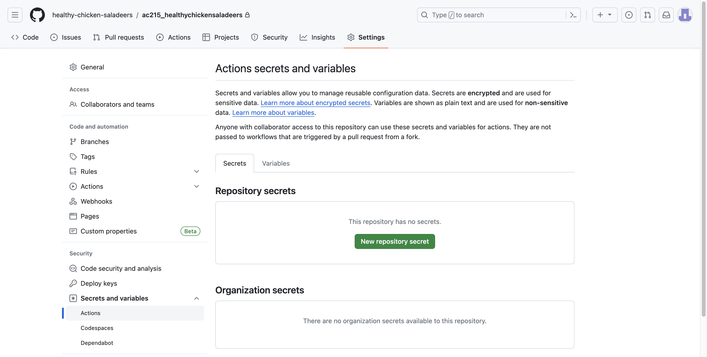
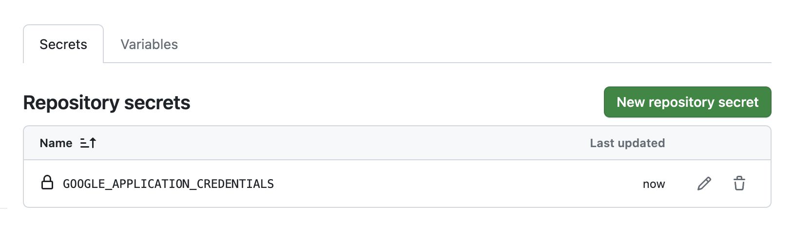

# Automated Deployment with GitHub Actions

Using GitHub Actions to automate the deployment of the app is key to achieving regular and reliable updates, a process called CI/CD. Continuous Integration and Continuous Delivery/Deployment (CI/CD) takes care of integrating and deploying changes automatically. This results in quicker feedback, faster software releases, better scaling, and more uniform deployments, making the overall development process faster and more responsive.

## Setup GitHub Action Workflow Credentials

We need to set up credentials in GitHub to perform the following functions in GCP:

* Push docker images to Google Cloud Registry (GCR)
* Update containers in the k8s cluster on Google Kubernetes Engine (GKE)

### Setup

#### GitHub Secrets

1. Go to "Settings" in the project repository.
2. Select "Secrets and variables" from the left side menu and choose "Actions".
3. Under "Repository secrets," click "New repository secret".



4. Name the secret `GOOGLE_APPLICATION_CREDENTIALS`
5. Copy and paste the contents of your deployment service account secrets file `deployment.json` into the text window.



#### Deployment files

Be sure to include the following files in your deployment container directory at  `src/deployment/`:

* `deploy-docker-images.yml`
    - This Ansible playbook builds Docker images for the frontend and API service, tags them with a timestamp, pushes them to Google Container Registry (GCR), saves the timestamp to a file, and cleans up unused Docker containers.
* `update-k8s-cluster.yml`
    - This YAML file defines an Ansible playbook that connects to a Kubernetes cluster, copies a Docker tag file, retrieves the Docker tag from the file, and updates the deployments for the frontend and API service in the specified Kubernetes namespace with the corresponding Docker image.
* `inventory.yml` & `inventory-prod.yml`
    - These YAML file contains variables related to Google Cloud Platform (GCP), specifying service account details, authentication settings, and project information for use in deployment scripts or configurations.
* `deploy-app.yml`
    - The commands in this file execute Ansible playbooks named `deploy-docker-images.yml` and `update-k8s-cluster.yml` using the inventory files `inventory.yml` and `inventory-prod.yml` respectively, to manage deployment of Docker images and update a Kubernetes cluster in a production environment

A workflow YAML file will also need to be saved in the repository at `.github/workflows/`:

* `deploy-docker-images.yml`
    - The YAML file implements a CI/CD workflow that:
        * Invokes docker image building and pushing to GCR on changes to code in the respective containers and a git commit has a comment "/run-deploy-app".
        * Deploy the updated containers to the k8s cluster in GKE.

    - This GitHub Actions workflow triggers on pushes to the main branch, checks if the commit message contains '/run-', sets up the environment with Google Cloud SDK and Docker, lists files, builds a deployment container, and, if the commit message contains '/run-deploy-app', deploys the Rag Detective App using specified configurations and scripts.


## Update the k8s Cluster

Upon modifying either the api_service or frontend containers, the updated changes can be applied to the containers running on our Kubernetes cluster in Google Kubernetes Engine (GKE) by pushing the changes to GitHub. Ensure that your commit includes the comment "/run-deploy-app".

```
git add .
git commit -m "/run-deploy-app"
git push
```

You can view the progress the deployment in GitHub under the Actions tab:


