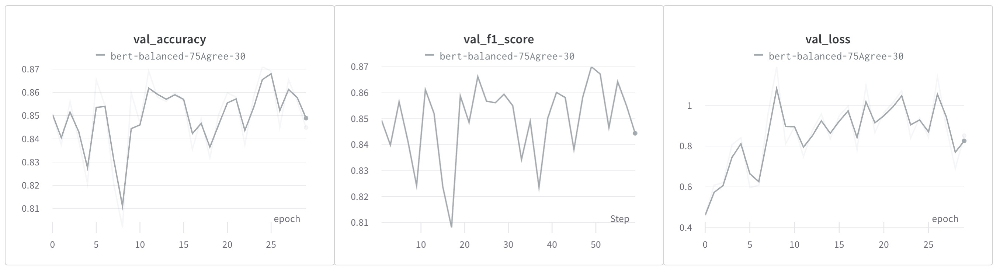
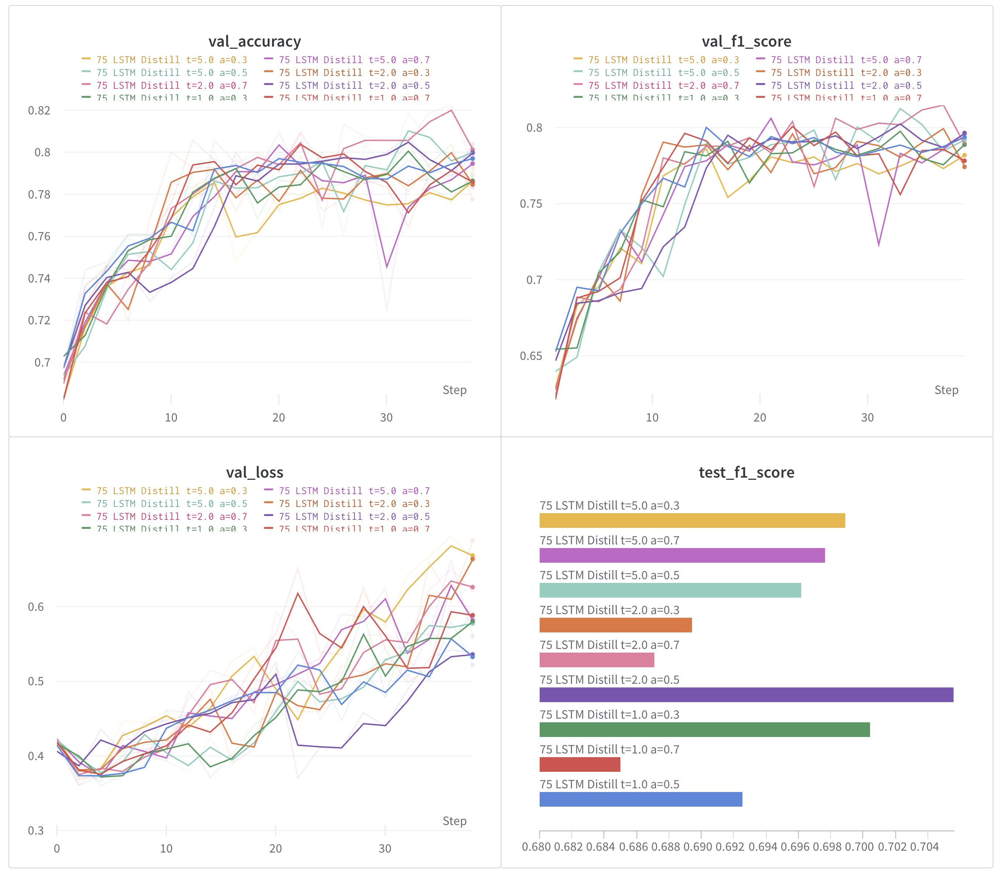
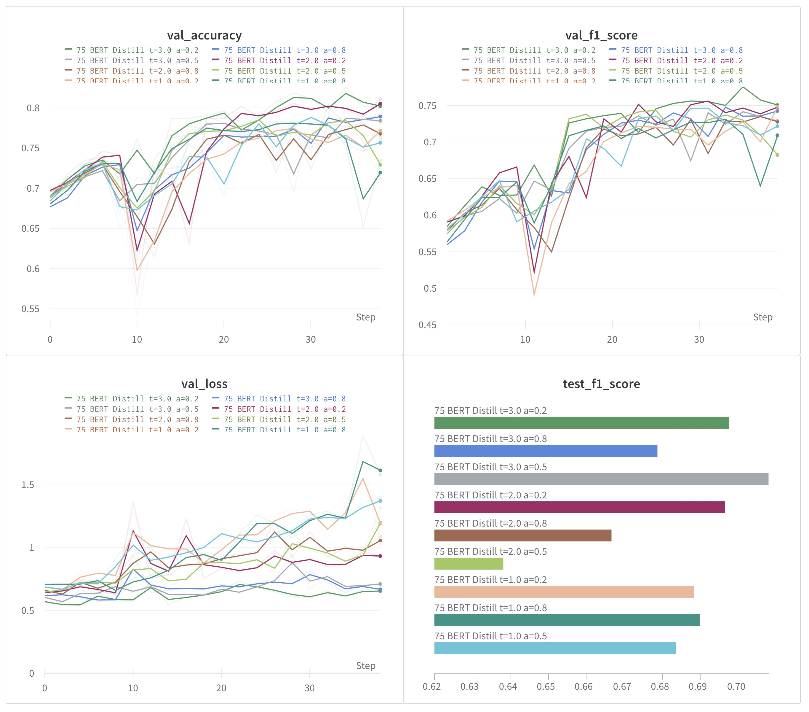
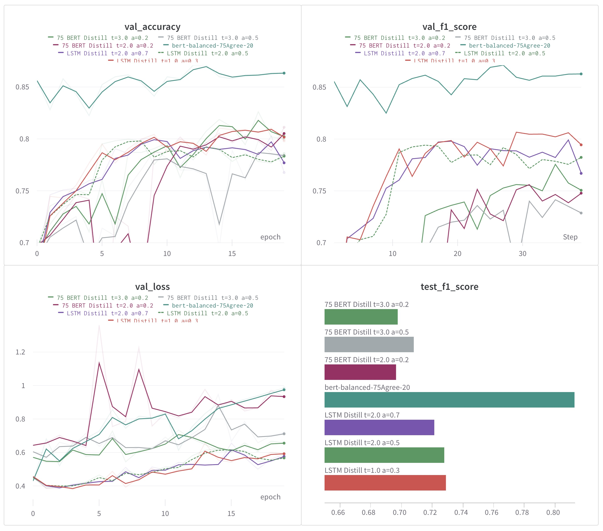

# Optimizing BERT for Financial Sentiment Analysis

The model we chose for fine-tuning and optimization, BERT, especially the `bert-base-uncased` variant, is a commonly used foundation model for NLP tasks. When fine-tuned, it can be a powerful tool for financial sentiment analysis. To deploy BERT in real-world applications, especially on edge devices or under latency constraints, we want to optimize its size and speed. In our project, we tried three main optimization techniques: quantization, pruning, and distillation. It turned out we chose a challenging, complex model to conduct these techniques on.

This document references two training notebooks. The first is for fine-tuning and checkpointing BERT on the 75Agree dataset, and the second creates 9 versions of the LSTM and 9 versions of the smaller BERT model by doing grid search on the hyperparameters. They can be found here:

- [75Agree_balanced_30_checkpointed.ipynb](../notebooks/BERT_fine-tune_financials_balanced/75Agree_balanced_30_checkpointed.ipynb)

- [bert_lstm_distillation_75.ipynb](../notebooks/distillation/bert_lstm_distillation_75.ipynb)

Some initial research about using these methods on large language models led us to the following starting point:

**Most Likely to Succeed**: 

- **Distillation** has shown consistent results across various tasks and models. Given the domain specificity of financial sentiment analysis, distilling BERT into a smaller model tailored to this task seems promising.

**Riskiest**:

- **Pruning**, especially aggressive pruning, poses risks for transformer architectures. The inter-dependencies in self-attention mechanisms can be sensitive to drastic pruning. 

Let's go over our methodology.

## 1. Quantization

**Quantization** involves converting the model's weights (and sometimes activations) from 32-bit floating-point numbers to lower bit-width, such as 8-bit integers.

### Pros:
- **Size Reduction**: Quantized models occupy significantly less memory.
- **Speed**: On hardware that supports integer operations, quantized models can run faster.

### Cons:
- **Accuracy Trade-off**: Quantization can lead to a slight degradation in model accuracy.

### Applicability to BERT:
Given the size of `bert-base-uncased`, quantization can substantially reduce its memory footprint. TensorFlow Lite offers tools for post-training quantization. For BERT, weight quantization is safer than full integer quantization, as activations in transformers can have dynamic ranges.

## Our challenges in Quantizing our BERT Model

#### TensorFlow Lite and Dynamic range quantization

We discovered early on that most of the built-in quantization in TensorFlow is geared towards running models on edge devices, and use another framework called TensorFlow Lite. **Dynamic range quantization**, the first method we tried, required this conversion. The TensorFlow Lite converter has an option to quantize the model weights to 8-bit integers during this process, saving considerable amounts of memory and improve execution speed.

However, we hit a major problem in the conversion of BERT. When using the converted TFLite model's interpreter, the observed expected input shape was [1, 1], indicating that the model was expecting a single token as input. This was unusual for a BERT model, as BERT is designed to look at entire sequences of tokens, not just a single one. The expected input shape was noted from both the 'shape' and 'shape_signature' field of TFLite model's inputs. Ensuring the correctly expected shape for BERT-style inputs during conversion is vital for the model to work, but we couldn't find any reason why our converted model stopped behaving like BERT. It could be just that the Hugging Face `Transformers` library is not compatible with TensorFlow Lite due to the size of some of the models. In short, we couldn't convert BERT to a TFLite model.

### Other quantization methods in TensorFlow

#### Quantization-aware training (QAT) and Post-training quantization

- **Quantization-aware training (QAT)**: Quantization is considered during the training process itself. This can often result in better model accuracy compared to post-training quantization because the model is trained while being aware of the quantization errors. The model's weights are quantized during training, and the forward pass simulates the effects of quantization. By doing so, the model can adapt to the quantization process and can potentially provide more accurate results than simple post-training quantization.

- **Post-training quantization**: This is done after the model has been trained. There are multiple ways to perform post-training quantization:
   - **Weight Quantization**: Only the weights are quantized, but the activations remain in floating-point.
   - **Full Integer Quantization**: Both weights and activations are quantized to integers. This can significantly reduce model size and increase inference speed, especially on hardware that's optimized for integer operations.
   - **Float16 Quantization**: Convert all floating-point numbers (like weights and activations) to half-precision floating point (float16). This can help reduce model size while keeping a balance between accuracy and performance.

After a lot of experimentation and trying different methods, we found that both post-training quantization and quantization aware training in the TensorFlow Model Optimization Toolkit (TF-MOT) currently supports only Keras Sequential and Functional models. The BERT model loaded from Hugging Face transformers is a subclassed model, which is not currently supported.

Unfortunately, this meant that we could not use post-training quantization or QAT from TF-MOT to quantize the Hugging Face's BERT model directly. For this reason we moved on to pruning as an optimization technique.


## 2. Pruning

**Pruning** involves removing certain weights or neurons from the model, turning them to zero, based on certain criteria (like magnitude).

### Pros:
- **Size Reduction**: Sparse models can be compressed further.
- **Speed**: Some hardware can accelerate sparse operations.

### Cons:
- **Accuracy Trade-off**: Pruning can lead to accuracy drops if not done carefully.

### Applicability to BERT:
BERT has millions of parameters. By pruning, we can obtain a sparser model. However, aggressive pruning can degrade the performance of transformers. Gradual pruning during retraining is recommended.

### More issues with TF-MOT

The TensorFlow Model Optimization Toolkit also offers pruning capabilities. But similar to quantization, it is only compatible with Sequential or Functional Keras models rather than Subclassed models, which include models loaded from Hugging Face's Transformers.

To apply pruning using TF-MOT, the model needs to be wrapped similar to quantization, and the same compatibility issues arose as they did with quantization. Subclassed models like Hugging Face's `bert-base-uncased` don't expose their internal layer structure the way `Sequential` and `Functional` models do, which makes it more challenging for techniques like pruning and quantization.

We could have manually modified the `BERT` model to be a `Functional` model, but that would be quite complicated due to the interdependencies of the layers inside and effectively rebuilding `BERT` from scratch, which would really be taking us far from our original vision of this project.

## 3. Distillation

Distillation, often referred to as "knowledge distillation," is a technique in which a smaller model (the "student") is trained to mimic the behavior of a larger, more complex model (the "teacher"). The main idea is to transfer the "knowledge" from the teacher model to the student model, allowing the student to achieve better performance than if it were trained directly on the data.

Here's a deeper dive into how distillation works, particularly focusing on the loss functions:

## Loss Functions in Distillation:

### 1. Hard Target Loss:

This is the traditional loss used when training neural networks. It computes the difference between the predictions of the student model and the ground truth labels in the dataset.

If $y$ is the ground truth and $\hat{y}_{student}$ is the prediction from the student:

Hard Target Loss = $L(y, \hat{y}_{student})$


For classification tasks, this is usually the cross-entropy loss.

### 2. Soft Target Loss:

This loss computes the difference between the soft predictions (logits or probabilities) of the teacher model and those of the student model. The "soft" predictions are often obtained by raising the temperature of the softmax function used in the final layer of the model.

Given the logits from the teacher $z_{teacher}$ and the logits from the student $z_{student}$, the soft target loss can be expressed as:

Soft Target Loss = $L($ Softmax $(z_{teacher}/T),$ Softmax $(z_{student}/T))$

where
- $T$ is the "temperature" hyperparameter. A value greater than 1 makes the softmax outputs softer (i.e., closer to a uniform distribution), which emphasizes the relationships between classes.

## Combining the Losses:

To train the student model, a weighted combination of the hard target loss and soft target loss is used:

Total Loss = $\alpha \times$ Hard Target Loss $+ (1-\alpha) \times$ Soft Target Loss

where
- $\alpha$ is a hyperparameter that controls the weighting of the respective losses. $\alpha$ values closer to 1 put a greater emphasis on the hard labels, and $\alpha$ closer to zero emphasize the teacher model's logits.

The soft targets capture the relationships between different classes. In our 3-class classification for financial sentiment (negative, positive, or neutral), if a particular input results in the teacher model assigning high probabilities to class 3 and slightly lower probabilities to classes 1 and 2, this provides more information than simply knowing the ground truth is class 3. The student model learns from this additional information, which helps in its generalization.

### Pros:

- **Compact Model**: Obtains a smaller model with comparable performance.
- **Maintained Accuracy**: When done correctly, the distilled model retains most of the accuracy.

### Cons:

- **Training Complexity**: Requires a two-step process: training the teacher and then the student.

### Applicability to BERT:

Distillation can be an effective approach for BERT. Given its depth, a shallower model can be trained to mimic BERT's performance, especially if we're focused on a specific domain like financial sentiment analysis.

## Our distillation methodology

Our initial experimentation with the 4 datasets of different levels of annotation consensus can be found [here.](experiment-bert.md) We continued on from this however to dig deeper by running the fine-tuning for more epochs and seeing which models had the best validation F1 scores, which we added to be calculated for every epoch.

Our results were surprising and changed our view yet again, as the `75Agree` dataset, which indicated 75% consensus, now appeared to give the best results by far in terms of both accuracy and f1.


### We fine-tuned BERT with Model Checkpointing and F1 Evaluation using a different dataset and for 30 epochs

The main changes we implemented here involved calculating the F1 score at the end of each training epoch, and saving the model that achieves the best F1 score on the validation data. This well-performing model is subsequently exploited to evaluate its performance on unseen test data.

## Steps

**Step 1:** Login into the Weights & Biases platform to track the experiment metrics.

**Step 2:** Load the pre-trained BERT sequence classification model which is designed to classify inputs into one of the three labels.

**Step 3:** Defined the loss function as `Sparse Categorical Crossentropy` loss in this case. Also, configure the optimizer `Adam` with a learning rate schedule.

**Step 4:** Initialize the Weights & Biases project to monitor experiment metrics. Set up the custom `F1_Evaluation` Callback which saves the model whenever there is an improvement in the F1 Score.

**Step 5:** Invoke the model training over 30 epochs, incorporating the callbacks to log metrics to Weights & Biases, and perform custom F1 evaluation and model checkpointing. This is an increase to the 10 we had originally done and even the 20 we did later. Through model checkpointing this was a convenient way to find our most performant model that wasn't overfitting.

**Step 6:** Post training, utilize the plot function defined to visualize the trend of loss, accuracy, and F1 score on the training and the validation data.

**Step 7:** Load into memory the trained model saved during the F1 Evaluation. Disable further training of this model to evaluate its performance as is on the test dataset.

**Step 8:** Predict labels for the test data with this model. Obtain a comprehensive classification report with precision, recall, f1-score, and support.

**Step 9:** Log the F1 score achieved on the test dataset into the Weights & Biases dashboard. 

## Hyperparameters

- **Learning Rate Schedule:** An initial learning rate of `3e-5`, which gradually decays as per an exponential decay schedule with decay steps set to `10000` and decay rate set to `0.9`.
- **Batch Size:** Set to `8` for both validation and training datasets.
- **Epochs:** The model is trained over `30` epochs.
- **Interval for F1 Evaluation:** F1 score is calculated at the end of each epoch, thus, the interval is set to `1`.

In this particular run, we reached an F1 of 0.87 and an accuracy of 0.8655 at epoch 24 (the `val_f1_score` was saved in reference to `step` but this can be seen from the `val_accuracy` and `val_loss plots`. This is a pretty good result and better than our previous best of about .84 using the `66Agree` dataset.

Since the model was checkpointed upon reaching its best f1 score at epoch 24, it didn't affect it to continue the training for visualization purposes.

The full training can be seen in the [75Agree_balanced_30_checkpointed.ipynb](../notebooks/BERT_fine-tune_financials_balanced/75Agree_balanced_30_checkpointed.ipynb) notebook.



## Distillation

At this point, with out best BERT fine-tuned model checkpointed and saved, it was time to distill some smaller models using it as a teacher model. The full training can be seen in the [bert_lstm_distillation_75.ipynb](../notebooks/distillation/bert_lstm_distillation_75.ipynb) notebook.

# LSTM Model and Architecture

For the distilled version of the LSTM model, we define an LSTM-based hybrid architecture. 

1. **Embedding layer**: This initial layer maps the numerical word indices to dense vectors with a length of the pre-set `EMBEDDING_DIM`. This embedding dimension is usually a tunable hyperparameter. The embedding layer takes a `vocab_size` as the input dimension, which corresponds to the number of unique words in your vocabulary, and it outputs vectors with the shape defined by `embedding_dim`. Given the example, an input dimension of 30522 and embedding dimension of 64 are defined.

2. **Dropout layer**: This is a regularization technique to prevent overfitting in the model. It is set to randomly exclude some nodes (neurons) from the network during a training iteration with a rate of 0.5. This means that roughly half the nodes in the layer will be "turned off" during a training iteration.

3. **LSTM layer**: This is the core of the LSTM architecture. The LSTM (Long Short-Term Memory) layer allows for the learning and remembering of sequential or time-dependent behaviour in the data, which is essential in understanding the context within sentences when it comes to NLP tasks. In the LSTM layer, `HIDDEN_DIM` defines the number of LSTM units in the layer and `return_sequences` set to False instructs the LSTM to return only the output of the final timestamp. In the defined model, a Bidirectional LSTM is used, which involves duplicating the LSTM layer so that there are now two layers side-by-side, then providing the input sequence as-is as input to the first layer, and providing a reversed copy of the input sequence to the second.

4. **Another Dropout layer**: Similar to the earlier Dropout layer, but applied after the LSTM layer.

5. **Dense layer**: Finally, there is a dense layer that connects every neuron in the previous LSTM layer to every neuron in this layer. This layer has an output dimension the same as the number of classes (3 in this case), and it provides the final prediction outputs of the model.

In the `call` function, it sequentially takes the input through the embedding layer, dropout layer, LSTM layer, dropout layer, and the final dense layer.

The model also contains a custom loss function `loss_fn`, which combines `SparseCategoricalCrossentropy` and `MeanSquaredError` according to the formula: 

`(alpha) * SparseCategoricalCrossentropy + (1-alpha) * MeanSquaredError`. 

This custom loss function is used during the training of the LSTM model to not only capture the error from misclassification but also the difference between the true and predicted probabilities. This encourages the models to not only make correct classifications but also with correct confidence levels.

The custom loss function computes `SparseCategoricalCrossentropy` loss by comparing between the true class index (derived from the original BERT's logit outputs) and predicted class probabilities while `MeanSquaredError` loss is calculated by squaring the differences between the true class probabilities produced by the softened teacher model and the class probabilities predicted by the student model.

## Data Preprocessing

Our dataset containing a column of sentences and a corresponding column of labels will have to be transformed into suitable input for the LSTM model.

1. **Tokenization**: The text data (sentences) are tokenized into words or smaller subwords, and these tokens are then converted to numerical indices.

2. **Padding**: To ensure that all data can be handled in a batch operation, it is necessary to ensure that all the sequences are the same length. This is typically done by truncating longer sequences, and for shorter sequences; this is achieved by appending zero to the end (also known as padding).

3. **Label Encoding**: For the labels, one common practice is to convert the target labels to one-hot encodings. For instance, if your model is performing a classification task over n classes, each label will be transformed into a vector of length n, where all elements are 0, except for the index representing the class, which will be 1.

# Tokenization

The tokenization process for LSTM and BERT models is fundamentally different due to the nature of the two models and the tokenization methods they employ.

### LSTM Tokenization:

1. **Vocabulary Creation**: The LSTM model uses a `Tokenizer` from Keras, which creates a vocabulary index based on word frequency. Every word gets a unique integer value, and the most frequent word gets the lowest integer, which is 1.

2. **Text to Sequences**: The `texts_to_sequences` method is used to transform each text in the dataset into a sequence of integers. It converts the text into a list of word indexes, looking up each word in the previously constructed word index.

3. **Padding**: The `pad_sequences` method is then used to ensure that all sequences in a list have the same length, by padding them with zeros at the end (post-padding).

4. **Vocabulary Size Limit**: There is a `VOCAB_SIZE` parameter that limits the number of words to be considered in the vocabulary. This truncates the vocabulary to keep only the top `VOCAB_SIZE` words.

### BERT Tokenization:

1. **Pretrained Tokenizer**: BERT uses a pretrained tokenizer (`BertTokenizer`) that is designed to match the tokenization used in the BERT model during its pretraining. This tokenizer splits words into tokens that BERT has been trained on.

2. **WordPiece Tokenization**: BERT utilizes the WordPiece tokenization method. This method breaks words down into sub-word units, which helps the model to deal with out-of-vocabulary words more effectively.

3. **Special Tokens**: The BERT tokenizer also adds special tokens, like `[CLS]` at the beginning of each sequence and `[SEP]` at the end of each sequence, which are required by BERT for classification tasks and differentiating sentence pairs.

4. **Fixed Vocabulary**: BERT has a fixed vocabulary size (e.g., 30,522 words for `bert-base-uncased`), and every word or sub-word is represented by a unique ID within this fixed vocabulary.

5. **Padding and Attention Mask**: In addition to padding sequences, BERT requires an attention mask to let the model know which tokens are padding and which are not, as BERT processes fixed-length sequences.

The LSTM tokenizer is more straightforward, creating a simple index and transforming texts into sequences of integers. In contrast, the BERT tokenizer is tailored to the needs of the BERT model, using sub-word tokenization and additional metadata like special tokens and attention masks.

# Out-of-vocabulary (OOV) Words for the LSTM

The LSTM tokenizer provided by Keras' `Tokenizer` class does not inherently handle out-of-vocabulary (OOV) words in the same way that BERT's WordPiece tokenizer does.

1. **Limited Vocabulary**: When the `Tokenizer` is instantiated with a `num_words` argument (we use the `VOCAB_SIZE` constant), it only keeps that many most frequent words in the vocabulary. All other words are considered out-of-vocabulary.

2. **Ignoring OOV Words**: During the `texts_to_sequences` call, words that were not seen during the `fit_on_texts` call or that are not in the top `VOCAB_SIZE` words are simply ignored (not included in the sequences).

3. **OOV Token**: To handle OOV words explicitly, set the `oov_token` parameter when creating the `Tokenizer` instance. This will assign a specific index to OOV words. All OOV words will be replaced with this token in the sequences.

In the basic configuration, if a word is not in the top `VOCAB_SIZE` most frequent words that the `Tokenizer` was trained on, it will be skipped in the sequence. To handle OOV words by including them as a special token in the sequences, add the `oov_token` parameter to the `Tokenizer`:

```python
lstm_tokenizer = Tokenizer(num_words=VOCAB_SIZE, oov_token='<OOV>')
```

With this enabled, during text conversion to sequences, any word that is not in the `Tokenizer`'s vocabulary will be represented by `<OOV>`. This is can make the model robust against words it hasn't seen before.

The decision to handle out-of-vocabulary (OOV) tokens explicitly or to ignore them depends on the specific use case, the characteristics of the dataset, and the goals of the model. 

### Decision Factors:

- **Task Relevance**: If OOV words are likely to carry important meaning for the prediction task, then we should handle them.
- **Frequency of OOV Words**: If the training data is large and diverse enough that OOV words are rare, the impact of ignoring them might be negligible.
- **Dataset Consistency**: If the dataset used for training is representative of the data encountered in production, ignoring OOV words might be acceptable.
- **Model Capacity**: If the model is smaller with limited capacity, handling OOV tokens might be a way to prevent it from being overwhelmed by the variety of words it needs to learn.

In practice, it's common to handle OOV tokens, especially in tasks like sentiment analysis, where the sentiment might be significantly altered by a single word. Using an OOV token allows the model to potentially learn the impact of unknown words in context, even if it doesn't know the word itself. In contrast, for large-scale models trained on extensive corpora, the OOV rate might be low enough that the trade-off of ignoring these words could be acceptable.

The best approach is empirical: we try both methods and then evaluate the model's performance on a validation set. We found that handling OOV was better for our smaller dataset with more financial terms that could be OOV than regular English text.  However, this method doesn't provide the granularity of handling that sub-word tokenization in models like BERT offers.

# Out-of-vocabulary (OOV) Words for BERT

BERT's WordPiece tokenization is designed to effectively handle out-of-vocabulary (OOV) words through the use of subword tokenization.

1. **Splitting into Subwords**: WordPiece breaks down words into known subwords or characters. A word like "embeddings" might be split into "embed" and "##dings" if "embed" is a known token but "embeddings" is not in the vocabulary.

2. **Using Subwords for Rare Words**: For words that are not in the vocabulary, WordPiece tries to find the longest subword that is present in the vocabulary and then continues with the rest of the word, breaking it down further. This means that almost any word can be represented as a sequence of subword tokens.

3. **Handling the Remaining Characters**: If a subword or character sequence is not found in the vocabulary, it will be broken down to individual characters. This ensures that WordPiece can tokenize any word, even if it has never been seen before, by falling back to character-level tokenization.

4. **Start of Word Marker**: Subwords that appear in the middle of a word are typically preceded by '##' to indicate that they are not standalone words but are part of a larger word.

As an example, the phrase "I just bought a Technotronix smartphone" might be tokenized like this:

["I", "just", "bought", "a", "Tech", "##not", "##ron", "##ix", "smartphone"]

To tokenize the word "Technotroix", it could be broken down into ["Tech", "##not", "##ron", "##ix"].

The tokenizer would start by trying to find the longest substring starting from the beginning of the word that exists in its vocabulary. "Tech" might be a recognizable token associated with technology-related terms. Since "notronix" is not in the vocabulary, the tokenizer would then look for the next largest substring it recognizes, which might be "not", and so on until the entire word is tokenized into recognizable pieces.

This subword tokenization strategy enables the BERT model to understand and process words that weren't in its training data, which greatly enhances its ability to understand and generate language, even when faced with new or rare words.

## Training Process

We now prepare the LSTM model for training, train it, and then evaluate it.

1. **Weights and Biases (WandB) Setup**: After initializing a run with WandB, we name the run `75 LSTM Distill t={str(temperature)} a={str(alpha)}`, where temperature and alpha are the parameters for the distillation process. The `75` refers to the `75Agree` dataset with 75% consensus, and the training will be run in a grid search with different values of `temperature` and `alpha`.

2. **Teacher Model's Logits Calculation & Softening**: The teacher model's logits for both training and validation datasets are calculated by utilizing the `predict` function on the teacher BERT model. The logits are then softened by applying the `softmax` function to them and dividing it by the `temperature` variable. This process makes the teacher's predictions more "confident" when the temperature is low and makes them more "uncertain" when the temperature is high.

3. **Tokenizer Creation and Texts Processing**: We create a tokenizer for the LSTM model, which is different from the tokenizer used for the BERT model. It's created with a maximum number of words equal to the VOCAB_SIZE, which for BERT is `30522`. This tokenizer is fit on the training sentences. The text to be fed into LSTM are then converted into sequences of tokens. In addition, we used padding to ensure all sequences have the same length - that is, they fit into the LSTM model.

4. **Student Model Construction**: We then create an LSTM model treated as a student distillation model. Its architecture is defined by the LSTM Distilled class earlier with the constants such as vocab size, embedding dimension, LSTM units, output, dropout rate, and alpha. After compiling the model with an optimizer, our custom loss function, and accuracy metric, we also use a callback to evaluate the F1 score after each epoch.
   
5. **Model Training**: The LSTM student model is trained using the preprocessed training data and the softened probabilities of the teacher model.

6. **Model Evaluation**: Once the LSTM model training is complete, the test data is passed through the model to perform predictions. Then a classification report is printed, and the weighted F1 score is calculated and logged.

A summary of the LSTM model shows that the LSTM model has significantly fewer parameters compared to the BERT model (2.15 million vs 109.5 million) but still performs decently well. Despite the parameter count and size in MB being roughly 1/51st of that of BERT, the LSTM Distilled model's performance is quite decent with only a small drop in F1 score and accuracy.

## Performance Visualization

To visualize the performance of our LSTM model across epochs, we created a function `plot_training_process`. This function generates plots for various model metrics across epochs of training. 

- **Loss**: The plot shows the model loss, meaning how the model's training and validation loss evolved during the training process.

- **Accuracy**: Similarly, it plots the training and validation accuracy. 

- **F1 Score**: The validation F1 scores are also plotted to offer an idea of model performance throughout the training process.

The plots help in better understanding how well the model is learning and if it is overfitting or underfitting, by comparing the training and validation metrics. We noted that the LSTM model doesn't perform as well on the test data as expected, which is valuable information for if this is a viable option.

# Smaller BERT Model and Architecture

For the distilled version of a smaller BERT model, several steps needed to be undertaken to prepare the model, modify it for a specific use case, and to prepare the data accordingly.

1. **Tokenizer**: As in the larger BERT model, the first step involves loading a pre-trained BERT tokenizer. This tokenizer from Hugging Face's `transformers` library supports the functionality required to prepare text to the format expected by the smaller BERT model.

2. **Text to BERT format Conversion**: Texts are converted into BERT's input format, which includes tokenizing the text, truncating it if it exceeds the model's maximum input length, and padding it with 0s at the end if it is shorter than the maximum length, allowing BERT to accept input of a consistent size.

3. **Tensorflow Dataset Creation**: For optimal performance during training with Tensorflow, it's suggested to transform the data inputs and outputs into a Tensorflow dataset. For this, we created a helper function `make_tf_dataset`, which takes the encodings and the labels as input, and converts them into a dataset of input and output tensors. The function also assembles input features in the correct format expected by the BERT model. It creates a dictionary for each observation where the keys "input_ids" and "attention_mask" correspond to their respective values.

4. **Mapping Labels**: Labels are converted from their string representation to a numerical format. This is done using a dictionary `label2num` that maps labels ('negative', 'neutral', 'positive') to numbers (0, 1, 2). 

5. **Creating Tensorflow Datasets**: These numerical labels and BERT formatted encodings are used to create Tensorflow datasets for training, validation, and testing using the `make_tf_dataset` function.

6. **Custom Smaller BERT Model**: A custom BERT digitillation model is then created by subclassing the `tf.keras.Model` class. It takes a pre-trained BERT model and a parameter `alpha` as inputs during initialization. During the forward pass (`call` function), this model simply calls the BERT model on the provided inputs. 

7. **Loss Function Definition**: This custom function combines two different measures: 'hard' loss and 'soft' loss. The 'hard' loss is calculated using the Sparse Categorical Cross Entropy between the hard labels (i.e., the original labels) and the model's predictions. The 'soft' loss is calculated using the Kullback-Leibler Divergence between the teacher model's softened probabilities and the student model's probabilities. The total loss is then a combination of the two losses, controlled by the parameter `alpha`.

This approach allowed us to create a BERT student model with a custom architecture and loss function. It is designed to retain as much useful information as possible from the teacher model while operating using significantly lesser computational resources.

## Smaller BERT Distillation and Training Process

For the distillation of the smaller BERT model, the initial steps are again the creation of a Weights and Biases (WandB) run and retrieval of the teacher BERT model's softened probabilities. The student BERT model with half the number of hidden layers (6 instead of 12) is then prepared and trained through a similar process like the LSTM model.

1. **Weights and Biases (WandB) Setup**: Just like with the LSTM, this step initializes a Weights and Biases run with the specific project and run names including the fact that this is a BERT model, the temperature, and the alpha parameter.

2. **Calculate Teacher's Probabilities**: The logits for both training and validation datasets are calculated using the teacher BERT model. These logits are then softened using the softmax function and the temperature parameter. 

3. **Student Model Definition**: The student model is defined to be a version of BERT with 6 hidden layers and 3 output labels (the classes 'negative', 'neutral', and 'positive'). The student model is then initialised using the custom `DistillBert` class. 

4. **Preparing Data**: The softened probabilities of the teacher BERT model for the training and validation datasets are converted into TensorFlow datasets. Then, they are zipped with the corresponding TensorFlow datasets comprising the original data. This part was key to allowing the student to learn from both the labels and the teacher model.

5. **Optimizer and Learning Rate**: An `Adam` optimizer is used with an exponentially decaying learning rate and specific decay steps and rate. 

6. **Compiling Model**: The model is compiled using the optimizer defined in the previous step, the custom loss function from the DistillBert class, and accuracy as the metric to track.

7. **Callbacks**: A custom F1 score evaluation callback is prepared which triggers after every epoch. It was extremely important to give this F1 callback the original BERT tokenized dataset, and not the one with the probabilities from the teacher model zipped in. This caused a headache for quite a while until we discovered the differing shapes of `(654,)` and `(654,3` of the `preds` and `labels`.

8. **Model Training**: The student model is then trained on the dataset with the teacher probabilities acting as labels. 

9. **Evaluation**: Once training is complete, the student BERT model's performance is evaluated on the test data. A classification report provides precision, recall, F1-score, and support for each class. Model's F1 score is also computed and logged in the WandB dashboard.

An inspection of the student BERT model reveals it has a significantly lower number of parameters (67M against 110M in the teacher BERT model). However, despite its smaller size, it maintains relatively high performance. There is only a small drop in validation F1 score and accuracy, indicating a decent trade-off between performance and complexity. Despite its reduced size in comparison to the larger BERT model, the smaller BERT still requires a considerable amount of resources which is significantly more demanding than the LSTM model.

However, the test results indicate the smaller BERT model's performance decrease is worse than originally thought, with a decline in both F1 score and accuracy. It may not be a viable replacement for the full BERT model.

# The Hyperparameter Grid Search

Distillation requires a lot of experimentation and seems to be a bit of an art. We chose 3 values for the hyperparameters of `temperature` and `alpha` with some loose logic based on how we imagined they might work. All the plots below were trained using the 75Agree dataset but tested with data from all the datasets.

### For distilling BERT into the LSTM:

**Temperature**:

- 1 *This is effectively using the original logits from the teacher, and it's a good baseline to start with*
- 2 *A moderate temperature*
- 5 *A higher temperature to see if smoother probabilities help*

**Alpha (Weight for teacher soft labels vs. hard label loss)**:

- 0.5 *Equal importance to both*
- 0.7 *Slightly more importance to the teacher's soft labels*
- 0.3 *Slightly more importance to the hard label*




### For distilling BERT with 12 layers into BERT with 6 layers:

When distilling within similar architectures (like BERT-to-BERT), the student model can often mimic the teacher model more accurately. This might allow for different temperature and alpha values, so we made them lean more to the teacher model.

**Temperature**:

- 1 *Again, a baseline*
- 2 *A moderate temperature*
- 3 *Slightly higher but not as high as when distilling to an LSTM, since the architectures are more similar*

**Alpha**:

- 0.5 (Equal importance to both)
- 0.8 (More importance to the teacher's soft labels, since the architectures are similar and the student can likely benefit more from the teacher's nuances)
- 0.2 (More importance to the hard label, to ensure the distilled model doesn't stray too far from ground truth)



## Combined plots

Let's see how well our distilled models do against the original 110M parameter BERT model. As mentioned in the notebook:

### LSTM Parameter Summary

It is much smaller than the BERT model at 2.15 million parameter (8.21 MB) vs BERT's 109.5 million (417.7 MB). It's somewhat close in validation set performance:

* F1 score is 81.5 vs 87
* Accuracy is 82.2 vs 87.

So roughly a 5.5 point drop in F1 and a 4.8 point drop in accuracy for $\frac{1}{51}$ of the parameter count and size in MB. This makes it much less unwieldy for GPU memory and disk usage.

#### Test Results

Unfortunately the LSTM doesn't fare as well with the test data. The best performing LSTM model, the temperature of `2` and alpha of `0.7`, shows:

* F1 score of 0.69 vs 0.79
* Accuracy of 0.7 0.79

So the LSTM has a 9 point drop in test F1 and an 8 point drop in test Accuracy.

### BERT (6 layer distilled) Parameter Summary

It is smaller than the BERT model at 67 million parameter vs BERT's 110 million, but much bigger than the LSTM. It's somewhat close in validation performance to the BERT model, but:

* F1 score is 77.6 vs 87
* Accuracy is 82.6 vs 87.

So roughly a 9 point drop in F1 and a 4.4 drop in accuracy for 61% of the parameter count. It's much worse a trade-off than the LSTM.

#### Test Results

Unfortunately the 6 layer BERT doesn't fare as well with the test data. The best performing distilled BERT model, also the temperature of `3` and alpha of `0.2`, shows:

* F1 score of 0.7 vs 0.79
* Accuracy of 0.71 0.79

So the smaller BERT has a 9 point drop in test F1 and an 8 point drop in test Accuracy.

*It's clear from the plots below that while the LSTM and smaller BERT models just lag behind the orginal BERT model on the `75Agree` dataset by about 5 points in the validation data. However, the more real-world test data shows they lag behind by 10 points in both accuracy and F1. This might actually be a decent tradeoff for the relatively tiny LSTM model, which more than 50x smaller than BERT. However for the smaller BERT model, the performance is unacceptable given its large size.*




