# Serverless Model training with Vertex AI

Vertex AI is a machine learning platform offered by GCP. Vertex AI combines data engineering,
data science, and ML engineering workflows enabling easy collaboration in teams. It is also scalable,
as the project requirement gets larger, and allows us to execute training on as per need basis. Another
advantage is that it reduces the cost as compared to hosting a virtual machine with GPU.

In the context of this project, and milestone4 we have implemented a machine learning workflow
to train our Financial Sentiment Model using Bert and LSTM to train on Vertex AI using GPU. We
have also used other tools such as docker container, and bash scripting to facilitate, and automate
the process. 

## Prerequisites

Before you start, you need the following:
- A Google Cloud Platform account
- A project set up in GCP
- Docker installed.
- shell to execute bash scripts as in Linux system, and macos. 

## Step 1: API's to enable in GCP for Project

1. Go to the [Google Vertex AI ](https://console.cloud.google.com/marketplace/product/google/aiplatform.googleapis.com?q=search&referrer=search&authuser=1&project=rag-detective).
2. Click Enable API.


## Step 2: Setup GPU Quotas
In order to do serverless training we need access to GPUs from GCP.
- Go to [Quotas](https://console.cloud.google.com/iam-admin/quotas) in your GCP console
- Filter by `Quota: Custom model training` and select a GPU type, e.g: `Custom model training Nvidia T4 GPUs per region`


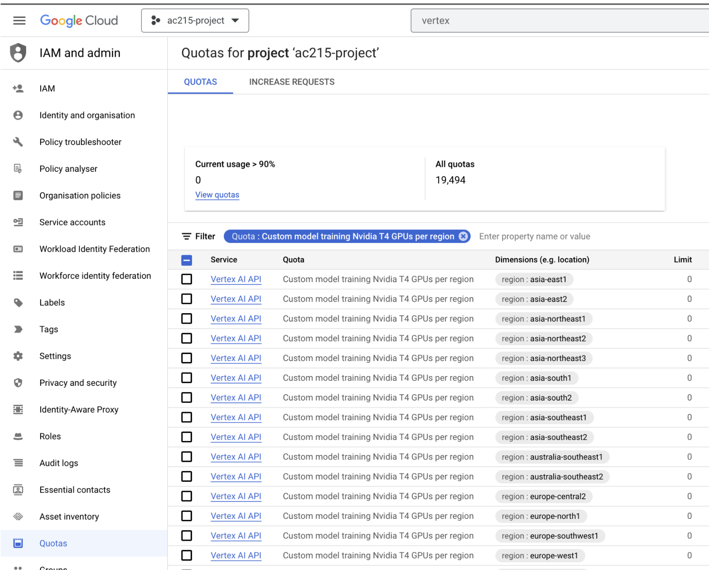

- Select a few regions

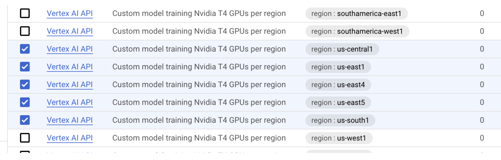

- Click on `EDIT QUOTAS`

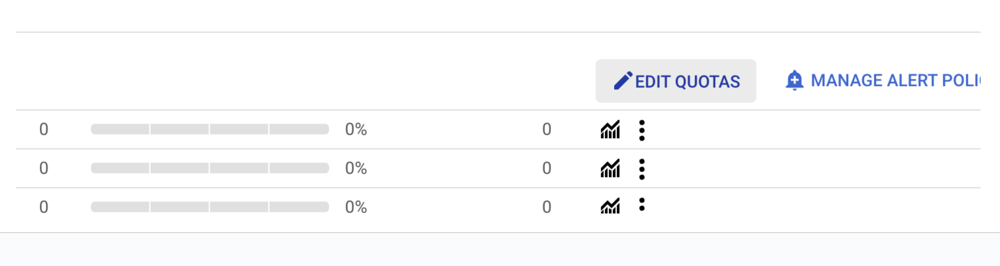

- Put in a new limit and click `NEXT`
- Enter your Name and `SUBMIT REQUEST`

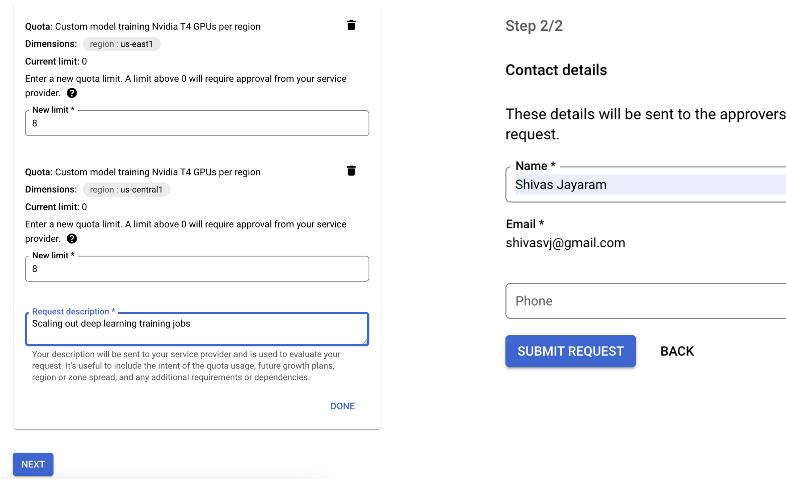

- This processes usually takes a few hours to get approved
- We have been approved a quota of 8 in us-central, and 4 in us-east region.

## Step 3: Setup GCP Service Account

- Steps to create a service account:
- To setup a service account you will need to go to [GCP Console](https://console.cloud.google.com/home/dashboard), search for  "Service accounts" from the top search box. or go to: "IAM & Admins" > "Service accounts" from the top-left menu and create a new service account called "model-trainer". For "Service account permissions" select "Storage Admin", "AI Platform Admin", "Vertex AI Administrator".
- This will create a service account
- On the right "Actions" column click the vertical ... and select "Manage keys". A prompt for Create private key for "model-trainer" will appear select "JSON" and click create. This will download a Private key json file to your computer. Copy this json file into the **secrets** folder. Rename the json file to `model-trainer.json`
- `model-trainer.json` should exist locally, and should not be checked into github. 


## Step 4: Create GCS Bucket
A GCS bucket is required to store both the packaged python files, and also the best model
after the training. 

- Go to [Cloud Storage](https://console.cloud.google.com/storage/browser)
- Create a bucket `sentiment-trainer`

## Step 5: Get WandDB API Key
In order to do experiment tracking from our model training, we require the api key for WANDB. 

- Login into [WandB](https://wandb.ai/home)
- Go to to [User settings](https://wandb.ai/settings)
- Scroll down to the `API keys` sections 
- Copy the key
- Set an environment variable using your terminal: `export WANDB_KEY=...`
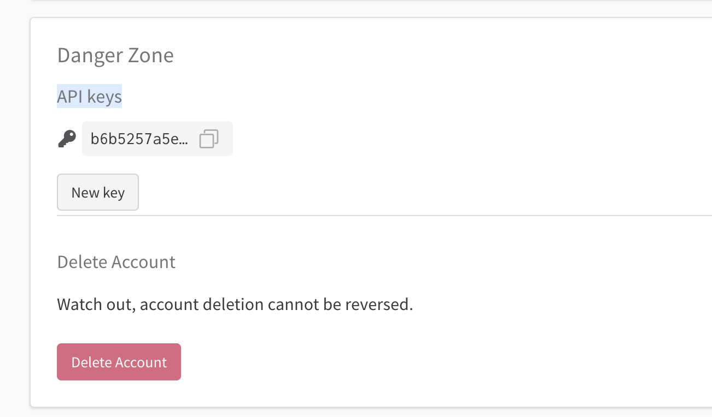


## Step 6: Setup directory Structure 

------------
    .
    └── ac215_healthychickensaladeers
        ├── model_training
            ├── docker-shell.sh
            ├── Dockerfile
            ├── docker-entrypoint.sh
            ├── cli.sh
            ├── package-trainer.sh
            ├── Pipfile
            ├── Pipfile.lock
            ├── package
            │   ├── setup.py
            │   ├── trainer
            │       ├──  __init__.py
            │       ├──  task.py
            ├── **secrets** (google service account key not shown)
            │   ├── .gitkeep


--------

## Step 6: Setup container
To make our setup independent of machines we created a docker container with all the libraries
for running creating our training task, and running it on Vertex AI. 

Create a `docker-shell.sh` bash script to build our docker, run, and set environmental variable
in our container for automation, and management of api keys. The script calls DockerFile which contains
the build definition for our docker container, and docker-entrypoint.sh which authorizes our google service
account. Once the execution is finished ,  a child shell starts inside the container. 

`docker-shell.sh`
```bash
#!/bin/bash

rm -f trainer.tar trainer.tar.gz
tar cvf trainer.tar package
gzip trainer.tar

echo $WANDB_KEY
set -e

export IMAGE_NAME=model-training-cli
export BASE_DIR=$(pwd)
export SECRETS_DIR=$(pwd)/../secrets/
export GCS_BUCKET_URI="gs://sentiment-trainer"
export GCP_PROJECT="rag-detective"


# Build the image based on the Dockerfile
docker build -t $IMAGE_NAME -f Dockerfile .
# M1/2 chip macs use this line
#docker build -t $IMAGE_NAME --platform=linux/arm64/v8 -f Dockerfile .

# Run Container
docker run --rm --name $IMAGE_NAME -ti \
-v "$BASE_DIR":/app \
-v "$SECRETS_DIR":/secrets \
-e GOOGLE_APPLICATION_CREDENTIALS=secrets/model_trainer.json \
-e GCP_PROJECT=$GCP_PROJECT \
-e GCS_BUCKET_URI=$GCS_BUCKET_URI \
-e WANDB_KEY=$WANDB_KEY \
$IMAGE_NAME
```

`docker-entrypoint.sh`

```bash
#!/bin/bash

echo "Container is running!!!"

# Authenticate gcloud using service account
gcloud auth activate-service-account --key-file $GOOGLE_APPLICATION_CREDENTIALS
# Set GCP Project Details
gcloud config set project $GCP_PROJECT


#/bin/bash
pipenv shell

```

- Note : Before executing `docker-shell.sh` on terminal , be sure that you are in `model_training` folder.

-- Execution on Ubuntu Linux system

```bash 
sudo sh docker-shell.sh

```
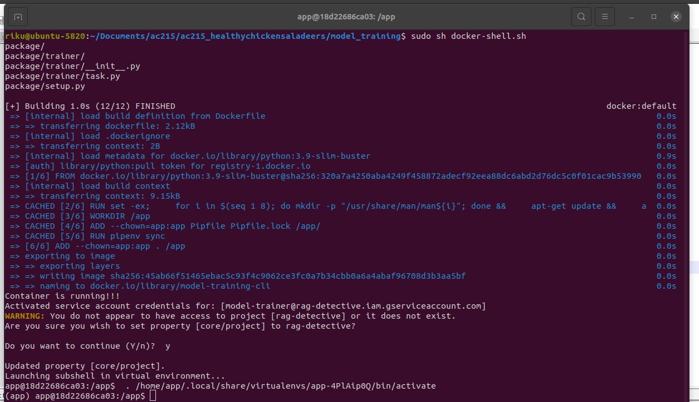


## Step 7: Prepare code for Vertex AI training. 

In this step we have taken our Jupyter notebook code for training our model, and created a new python file 
called `task.py` under model_training/package/trainer/. This includes all the code for training, experiment tracking, and finally storing our
best model in google bucket. 

We are using an argparser to extract the epochs, batch size, and wandb key for use in the code. These
arguments were passed by us when executing creating a Vertex AI training job. 

Here is a snippet 

```python
#Import necessary libraries
import os
import requests
import zipfile
import tarfile
import time
import argparse


# Used to suppress output for F1 validation calculation
import io
import contextlib

# For encoding detection
import chardet

import math
import numpy as np
import pandas as pd
import matplotlib.pyplot as plt
from sklearn.metrics import classification_report, f1_score
from sklearn.model_selection import train_test_split

# Hugging Face Transformers for BERT
from transformers import BertTokenizer, TFBertForSequenceClassification

# Deep learning frameworks
import tensorflow as tf
from tensorflow import keras
from tensorflow.keras import backend as K
from tensorflow.keras.callbacks import EarlyStopping

# Ensure we have a GPU
print("Num GPUs Available: ", len(tf.config.list_physical_devices('GPU')))

# Verify current GPU
device_name = tf.test.gpu_device_name()
if device_name != '/device:GPU:0':
  raise SystemError('GPU device not found')
print('Found GPU at: {}'.format(device_name))

# Weights and Biases for tracking experiments
import wandb
from wandb.keras import WandbCallback
from sklearn.metrics import f1_score
from google.cloud import storage

#command line arguments
parser = argparse.ArgumentParser()
parser.add_argument(
    "--epochs", dest="epochs", default=30, type=int, help="Number of epochs."
)
parser.add_argument(
    "--batch_size", dest="batch_size", default=8, type=int, help="Size of a batch."
)
parser.add_argument(
    "--wandb_key", dest="wandb_key", default="16", type=str, help="WandB API Key"
)
args = parser.parse_args()

# Rest of the code ....

```


## Step 8: Vertex AI setup.py

This file includes our instruction for Vertex AI to install the required packages for training our
model. Libraries such as Tensorflow , sklearn etc. is already included in the server where our model is 
going to be trained. We just need to include any special libraries for the Vertex AI to install. The file 
is located at model_training/package/

```python
from setuptools import find_packages
from setuptools import setup


REQUIRED_PACKAGES = ["wandb==0.15.11", "transformers==4.34.1", "chardet==5.2.0"]

setup(
    name="ragdetective-app-trainer",
    version="0.0.1",
    install_requires=REQUIRED_PACKAGES,
    packages=find_packages(),
    description="Rag Detective App Trainer Application ",
)

```

## Step 9: Upload our code for training on gcs bucket

`package-trainer.sh` contains code to copy our training files to google bucket. 

- Run `package-trainer.sh` on linux.

```bash
sudo sh package-trainer.sh

```

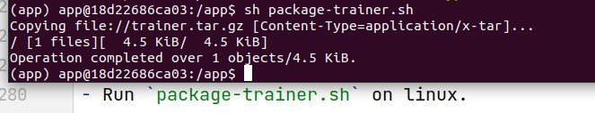


## Step 10: Create Jobs in Vertex AI 
For creating job for Vertex AI we have a bash script called `cli.sh`. The script creates a Vertex
AI job, and passes all  arguments that is required by Vertex AI, and command line arguments that our code
for model training `task.py`

- `cli.sh`
```bash
# List of prebuilt containers for training
# https://cloud.google.com/vertex-ai/docs/training/pre-built-containers

export UUID=$(openssl rand -hex 6)
export DISPLAY_NAME="ragdetective_training_job_$UUID"
export MACHINE_TYPE="n1-standard-4"
export REPLICA_COUNT=1
export EXECUTOR_IMAGE_URI="us-docker.pkg.dev/vertex-ai/training/tf-gpu.2-12.py310:latest"
export PYTHON_PACKAGE_URI=$GCS_BUCKET_URI/ragdetective-app-trainer.tar.gz
export PYTHON_MODULE="trainer.task"
export ACCELERATOR_TYPE="NVIDIA_TESLA_T4"
export ACCELERATOR_COUNT=1
export GCP_REGION="us-central1" # Adjust region based on you approved quotas for GPUs

export CMDARGS="--epochs=30,--batch_size=8,--wandb_key=$WANDB_KEY"


gcloud ai custom-jobs create \
  --region=$GCP_REGION \
  --display-name=$DISPLAY_NAME \
  --python-package-uris=$PYTHON_PACKAGE_URI \
  --worker-pool-spec=machine-type=$MACHINE_TYPE,replica-count=$REPLICA_COUNT,accelerator-type=$ACCELERATOR_TYPE,accelerator-count=$ACCELERATOR_COUNT,executor-image-uri=$EXECUTOR_IMAGE_URI,python-module=$PYTHON_MODULE \
  --args=$CMDARGS


```
- Run `cli.sh` on linux terminal

```bash

sudo sh cli.sh
```

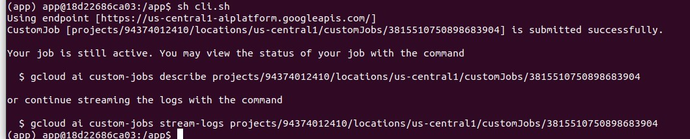

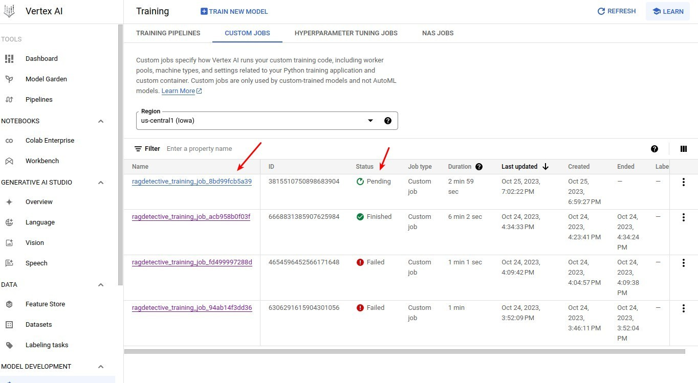


## Step 11: Monitoring model training and identifying issues.

We can check the progress of our model training by going to [Custom Jobs](https://console.cloud.google.com/vertex-ai/training/custom-jobs?project=rag-detective)

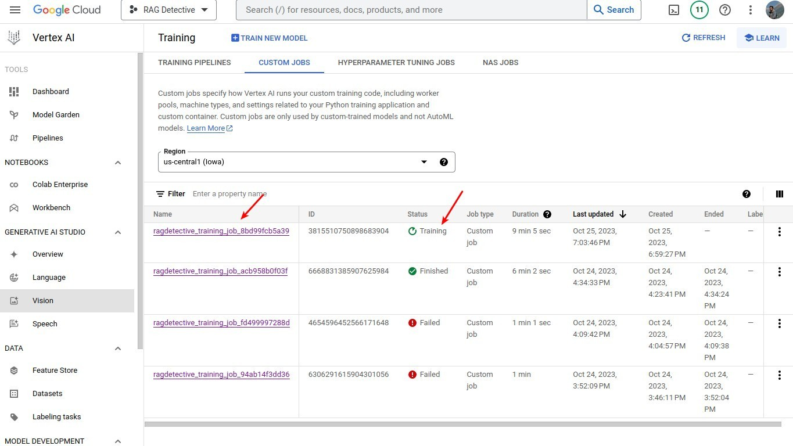

For issues we can look at the log by clicking on custom job. 

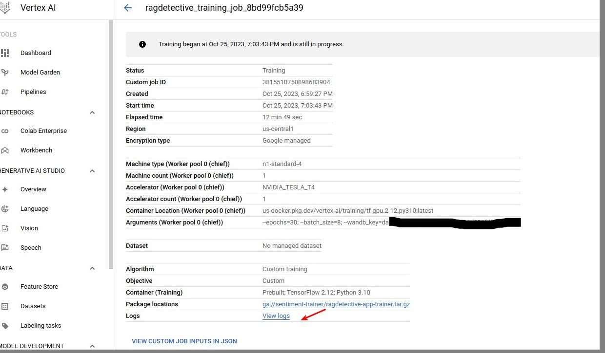

## Step 12: View training Metrics

- Go to [wandb](https://wandb.ai/home) 
- Select your project ac215-saladeers/bert-sentiment
- Metrics for weights and bias are shown there. 
