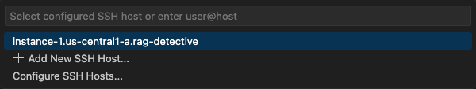
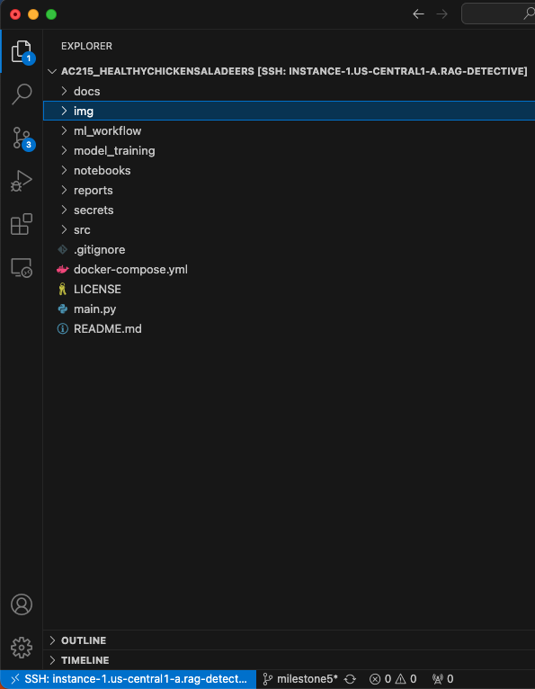

# Using VS Code Remote - SSH Extension to Connect to GCP VM

## Introduction

This guide outlines the steps to connect to a Google Cloud Platform (GCP) Virtual Machine (VM) using Visual Studio Code's Remote - SSH extension.

### Prerequisites

- [Visual Studio Code](https://code.visualstudio.com/) installed on your local machine.
- An SSH key pair generated on your local machine.
- A running GCP VM with an accessible external IP address.

## Steps

### 1. Install Google Cloud SDK

Follow the detailed steps in our documentation for setting up GCP SDK (for macos) found [here](https://github.com/healthy-chicken-saladeers/ac215_healthychickensaladeers/blob/milestone5/docs/gcp-cli-instructions-macos.md).

### 2. Install VS Code

If you haven't already, download and install Visual Studio Code [here](https://code.visualstudio.com/).

### 3. Install VS Code Remote - SSH Extension

In VS Code, go to the Extensions view (shortcut: `Ctrl+Shift+X` or `Cmd+Shift+X`), search for "Remote - SSH," and install the extension.

### 4. Generate SSH keys

You can generate the SSH keys (and connect to the server) using the `gcloud compute ssh` command. See the documentation [here](https://cloud.google.com/compute/docs/connect/standard-ssh).

The keys will be saved to the following paths:

```
~/.ssh/google_compute_engine # private key
~/.ssh/google_compute_engine.pub # public key
```

### 5. Create config file

Run the following command to create your config file at ~/.ssh/config:

```
gcloud compute config-ssh
```

Here is an example config file:
```
# Google Compute Engine Section
#
# The following has been auto-generated by "gcloud compute config-ssh"
# to make accessing your Google Compute Engine virtual machines easier.
#
# To remove this blob, run:
#
#   gcloud compute config-ssh --remove
#
# You can also manually remove this blob by deleting everything from
# here until the comment that contains the string "End of Google Compute
# Engine Section".
#
# You should not hand-edit this section, unless you are deleting it.
#
Host instance-1.us-central1-a.rag-detective
    HostName 34.42.138.162
    IdentityFile /Users/alyssa/.ssh/google_compute_engine
    UserKnownHostsFile=/Users/alyssa/.ssh/google_compute_known_hosts
    HostKeyAlias=compute.3618479747819751263
    IdentitiesOnly=yes
    CheckHostIP=no

# End of Google Compute Engine Section
```

### 6. Remote SSH: Add New SSH Host/Connect to Host

Open the VSCode command pallete shortcut: (shortcut: `Ctrl+Shift+P` or `Cmd+Shift+P`) and select `Remote SSH: Add New SSH Host...`. 

The first window will prompt you to add your username followed by the external IP address of your VM: `username@XXX.XXX.XXX.XXX`.

The next window will prompt you to add the config file found at ~/.ssh/config.

Next open the VSCode command pallete again and select `Remote SSH: Connect to Host...`. Your instance should appear in the drop-down window `instance-1.us-central1-a.rag-detective`. Select your instance.

 

### 7. Wait for Connection

VS Code will connect to your GCP VM, and the interface will change to indicate that you are working in a remote environment.

 

## Conclusion

You are now connected to your GCP VM using VS Code's Remote - SSH extension!